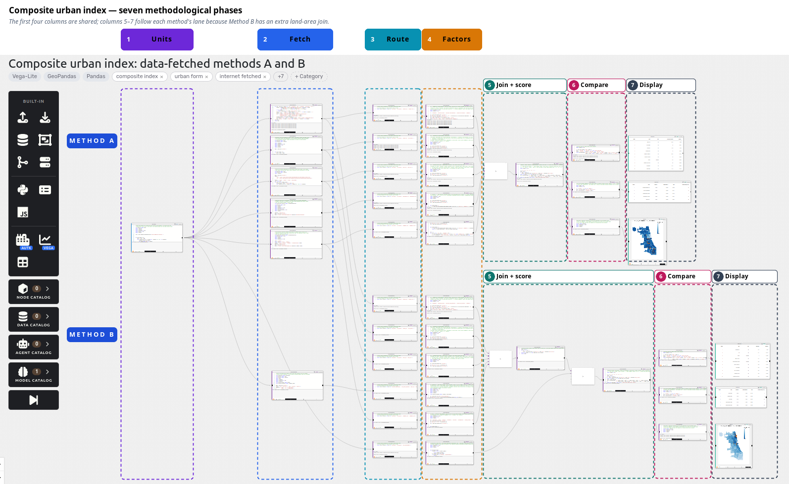

# Composite urban index: methodological phases

This documents the saved Curio dataflow **Composite urban index: internet-fetched methods A and B** (`62ab18dc-dbff-4bc6-9050-99536dea8854`). It describes what the nodes actually do, from published inputs to the two indices and the final comparisons with Brás. The [annotated screenshot](dataflow_phases.png) marks seven left-to-right phases. Its column outlines follow the upper **Method A** and lower **Method B** lanes separately after the factor calculations: Method B needs an additional land-area join, so its last three phases sit farther right.

The analytical question is: **How do São Paulo districts and Chicago Community Areas compare on a six-factor composite urban index, and which Chicago areas have index scores closest to Brás?** The flow scores **96 São Paulo districts** and **77 Chicago Community Areas**, for **173 reporting units**. It calculates two versions of the index from largely shared measurements.

| Phase | Nodes | What leaves the phase |
| --- | ---: | --- |
| 1. Reporting units | 1 | Valid district/community polygons, area measurements, hydrography, and runtime file paths |
| 2. Internet acquisition | 6 | Downloaded and prepared thematic files for places, dwellings, transit, buildings, roads, and GHSL |
| 3. Source routing | 11 | The exact file paths each A or B factor node needs |
| 4. Per-unit factors | 11 | One row per unit for each indicator; Method B also has land area |
| 5. Assemble and score | 6 | A and B index tables, each with 173 scored and ranked units |
| 6. Interpret and compare | 6 | Top-ten, Brás-comparison, and map-ready tables for each method |
| 7. Display | 6 | Two result tables and one Chicago map for each method |

## 1. Create the reporting geography

The leftmost node, **Fetch and prepare reporting units**, establishes the spatial frame used by both methods. A *reporting unit* is a São Paulo municipal district or a Chicago Community Area. It downloads the current Chicago Community Areas and hydrography GeoJSON files from the City of Chicago, and municipal districts and water polygons from GeoSampa's WFS. It does not read a previously installed Curio dataset.

For **Chicago**, the node repairs polygon geometry, projects it to **EPSG:26916**, checks that areas 01–77 are present, and creates `CHI:01` through `CHI:77` IDs. It computes each polygon's gross area in square metres. The hydrography file is retained for Method B's later land-area calculation.

For **São Paulo**, it projects the 96 municipal districts to **EPSG:31983**, repairs their polygons, and creates `SP:01` through `SP:96` IDs. In ascending district-ID order, it subtracts the area already covered by earlier districts. This makes the prepared polygons nonoverlapping for point assignments and area calculations. It then unions GeoSampa water polygons and records gross area, water area, and **land area = district polygon minus water**. The untouched municipal district geometry is also kept because the GHSL height calculation in Method B uses that version of the outlines.

The node creates a fresh temporary scratch directory and returns paths to these prepared files. “No locally installed data” means nothing has to be manually downloaded and registered before the flow runs; these **runtime scratch files** are the normal intermediate products of the internet-fetching pipeline.

## 2. Fetch and prepare the thematic sources

Six nodes fan out from the geography node. They use the reporting-unit footprints to select or crop internet sources for the two cities. Except where noted, they prepare the same raw measurements for both methods; they do not score a unit yet.

| Acquisition node | Published input and preparation | Factors supplied |
| --- | --- | --- |
| **Overture places** | Reads the **2026-08-19.0** Overture STAC collection, chooses GeoParquet assets whose footprints overlap a 2 km buffer around the reporting units, and uses DuckDB to fetch records whose bounding boxes overlap each city's extent. | `C` in A and B |
| **IBGE CNEFE and Census blocks** | Downloads **IBGE CNEFE 2022** addresses for São Paulo and **2022 TIGER/Line Illinois 2020 Census blocks**. It retains CNEFE's district, dwelling-type, coordinate-quality, and coordinate fields; for Chicago it retains blocks intersecting the city and their `HOUSING20` counts. | `R` in A and B |
| **CTA and SPTrans GTFS** | Downloads the **currently published** static GTFS ZIP for each agency. It extracts `stops`, `routes`, `trips`, and `stop_times`, the four tables needed to identify served stops and route types. | `H` in A and B |
| **Overture buildings** | Reads pinned **2026-08-19.0** Overture building assets. Chicago keeps the fetched building GeoParquet. São Paulo keeps buildings with positive reported height and materializes the height and projected bounding-box centre needed for the factor node. | `V` in A |
| **Overture road segments** | Reads pinned **2026-08-19.0** Overture transportation-segment assets overlapping each city, again through the STAC catalogue and DuckDB bounding-box filter. | `N` and `L` in A and B |
| **GHSL height/volume rasters** | Downloads the required **GHSL R2023A** 100 m tiles for three products: `H_ANBH_E2018`, `H_AGBH_E2018`, and `V_E2020`. It mosaics Chicago's two tiles, uses São Paulo's one tile, and crops/masks each raster to its city. | `V` in B |

The Overture filter is an **acquisition filter**, not the final spatial assignment: it fetches candidates near the cities; Phase 4 decides which places, buildings, and roads belong to each reporting unit. The temporary files are passed forward by path. CTA and SPTrans publish changing feeds, so rerunning this flow can change `H` and downstream index values even with unchanged code. The Overture release and GHSL product versions are pinned in the nodes.

For source auditing, the URLs embedded in the acquisition code are: [Chicago Community Areas](https://data.cityofchicago.org/resource/igwz-8jzy.geojson) and [hydrography](https://data.cityofchicago.org/resource/knfe-65pw.geojson); [GeoSampa WFS](https://wms.geosampa.prefeitura.sp.gov.br/geoserver/ows) layers `geoportal:distrito_municipal` and `geoportal:massa_d_agua`; [Overture release STAC](https://stac.overturemaps.org/2026-08-19.0/); [IBGE CNEFE São Paulo ZIP](https://ftp.ibge.gov.br/Cadastro_Nacional_de_Enderecos_para_Fins_Estatisticos/Censo_Demografico_2022/Arquivos_CNEFE/CSV/Municipio/35_SP/3550308_SAO_PAULO.zip); [Census Illinois blocks ZIP](https://www2.census.gov/geo/tiger/TIGER2022/TABBLOCK20/tl_2022_17_tabblock20.zip); [CTA GTFS](https://www.transitchicago.com/downloads/sch_data/google_transit.zip); [SPTrans GTFS](https://www.sptrans.com.br/umbraco/Surface/PerfilDesenvolvedor/BaixarGTFS); and the [GHSL R2023A archive](https://jeodpp.jrc.ec.europa.eu/ftp/jrc-opendata/GHSL/). This is an inventory of **coded endpoints**, not a guarantee that each provider will keep the same URL or data content indefinitely.

## 3. Route inputs into the two methods

The next column has **five A source nodes** and **six B source nodes**. Each is a small selector that takes the acquisition node's dictionary of runtime paths and returns only the keys needed by its downstream factor calculation. These selectors do not transform observations or compute an index; they make the dependencies explicit in the visual graph.

Both methods route places (`C`), residential data (`R`), GTFS (`H`), and road segments (`N`, `L`). They route different building inputs for `V`: **Overture buildings for A** and **GHSL rasters plus original municipal boundaries for B**. B alone routes the prepared reporting units and Chicago hydrography to its **land area** calculation.

This column is also the boundary between **shared acquisition** and **method-specific logic**. Eleven distinct selectors appear because the same fetched source can feed both lanes without asking the advisor to install a local dataset or import a helper function from this repository.

## 4. Calculate one factor table per reporting unit

Each factor node spatially assigns observations, then returns **one row for every unit** (or a numerator and denominator that will become one factor). The letter meanings are common to both methods, but the height measure differs.

### `C`: commercial establishments

The flow reads Overture Places and keeps records whose top-level taxonomy is one of `shopping`, `food_and_drink`, `services_and_business`, `lifestyle_services`, or `lodging`. It projects each place geometry to the city's reporting-unit CRS, assigns a place to a polygon only when the point is **within** it, and counts matches per unit. It does not filter by operating status or confidence. Units with no matches get zero. The same count feeds A and B; B later divides it by land area.

### `R`: residential establishments or dwellings

The two cities require different source-specific estimators:

- **São Paulo:** The CNEFE node uses address records with original census coordinates (`NV_GEO_COORD = 1`) to associate each CNEFE district code with the municipal district containing the most of its address points. It checks that the 96 codes map one-to-one to the 96 districts. It then counts all records identified as **private dwellings** (`COD_ESPECIE = 1`) by that crosswalk. Thus the georeferenced subset defines the code mapping, while the dwelling count uses all private-dwelling records.
- **Chicago:** Each 2020 Census block supplies `HOUSING20`. A block's housing units are allocated across Community Areas in proportion to the intersection area: `R(u) = Σ_b HOUSING20_b × area(block_b ∩ unit_u) / area(block_b)`. This gives a fractional estimate when a block crosses a Community Area boundary.

These two estimates are both labelled `R_count`. A uses them as counts; B uses them as counts per square kilometre of land.

### `H`: transport hubs

From the GTFS tables, the code joins stop times to trips and routes, deduplicates stop/route-type pairs, and identifies stops served by **route type 1** (subway/metro) or **route type 3** (bus). It then assigns station and bus-stop points to the polygons with a within-polygon test.

- **Chicago:** Rail platform stops are converted to their `parent_station` records, so `H_stations` counts CTA L stations rather than individual platforms. Bus stops are the served route-type-3 stops.
- **São Paulo:** Metro stops are grouped by `stop_name`; one station point is placed at the mean projected position of that name's stops. Bus stops are the served route-type-3 stops. **CPTM route type 2 is excluded** from this station definition.

The score later combines the two columns as `H = H_stations + H_bus`; Method B divides this sum by land area.

### `V`: two alternative building-height measures

- **Method A, Overture:** Keep buildings with reported height greater than zero. Assign each building by the **centre of its bounding box** to a reporting unit. The factor node returns a height sum and building count, and the score computes `V_A = height sum / building count`: the mean height of the eligible buildings assigned to the unit. Chicago's centre is obtained from Overture bbox coordinates and projected to EPSG:26916; São Paulo's projected centre was prepared in Phase 2.
- **Method B, GHSL:** Work with valid native **100 m raster cells** and each cell's overlap area `w_c = area(cell_c ∩ unit_u)` in the raster CRS. For every unit, the node returns `V_B_num = Σ_c w_c × AGBH_c` and `V_B_den = Σ_c w_c × (AGBH_c / ANBH_c)`, treating a zero `ANBH` as a zero fraction. The score uses `V_B = V_B_num / V_B_den`. Only cells valid in all three loaded rasters and with positive polygon overlap enter the sums. **The `V_E2020` raster is used to screen for valid cells, but its cell values do not appear in the numerator or denominator.** Despite the node's “volume ÷ surface” title, the implemented calculation is the stated ratio of weighted `AGBH` and `AGBH/ANBH` sums; it is **not** the mean of Overture building heights. The São Paulo GHSL calculation uses the unmodified GeoSampa municipal outlines retained in Phase 1; the other point/segment assignments use the prepared nonoverlapping outlines.

### `N` and `L`: street count and mean segment length

From Overture segments, the factor keeps `subtype = road` and these ten classes: `motorway`, `trunk`, `primary`, `secondary`, `tertiary`, `residential`, `living_street`, `pedestrian`, `unclassified`, and `unknown`. It projects the line geometry to city CRS and assigns the **entire segment** to the unit containing its point at 50% of line length. It records `N_count`, the number of assigned segments, and `L_sum`, their total projected length in metres. The score sets `N = N_count` and `L = L_sum / N_count` (mean segment length). A road crossing a boundary is **not split by that boundary**.

### B-only land area

The extra B factor is `land_km2`. For São Paulo it uses the prepared district's area after water subtraction. For Chicago it unions repaired hydrography polygons inside the city and subtracts that water geometry from each Community Area. `land_km2` is a denominator in B's count densities; it is **not a seventh equally weighted index factor**.

## 5. Assemble factors and calculate both indices

The merge nodes bring factor tables together. The actual computation nodes join them **one-to-one on `unit_id`**, check that there are exactly **173 unique units**, derive the six raw scoring variables, and reject missing factor values. B has an extra join with the B-only land-area table before scoring.

| Scoring variable | Method A raw value | Method B raw value |
| --- | --- | --- |
| `C` | Commercial-place count | Commercial-place count / land km² |
| `R` | Dwelling or housing-unit estimate | Dwelling or housing-unit estimate / land km² |
| `H` | Station count + bus-stop count | (Station count + bus-stop count) / land km² |
| `V` | Mean positive Overture building height | GHSL `V_B_num / V_B_den` |
| `N` | Road-segment count | Road-segment count / land km² |
| `L` | Mean road-segment length, metres | Same mean road-segment length, metres |

Within **each method separately**, the code finds the minimum and maximum of each raw variable over **all 173 São Paulo and Chicago units pooled together**. It applies min–max scaling, `scaled_f(u) = (raw_f(u) − min(raw_f)) / (max(raw_f) − min(raw_f))`, to each of the six variables. The composite is their **equal-weight sum**:

`Index_method(u) = scaled_C + scaled_R + scaled_H + scaled_V + scaled_N + scaled_L`.

Its nominal range is 0–6. The table retains each `raw_` and `scaled_` variable, the final `index`, and a descending `rank`; tied index values receive the minimum shared rank. Method A also retains gross area for display; B retains land area. Since **the raw definitions and scaling ranges differ**, an A score and a B score are two separate analyses, not interchangeable measurements on one fixed scale.

## 6. Turn index scores into the Brás comparison

Each scored table branches into three result-preparation nodes.

1. **Top ten:** Sort all 173 units by that method's index rank and show the first ten, pooling both cities. The table reports unit, city, method-specific area (gross area in A; land area in B), and the index rounded to three decimals.
2. **Five Chicago areas closest to Brás:** Take Brás as `SP:10`. For every Chicago area compute the **absolute index gap** `|Index(Chicago area) − Index(Brás)|`, sort ascending (breaking ties by `unit_id`), and return five. The table also calculates a **diagnostic profile rank** among all 77 Chicago areas: Euclidean distance between the area's six *scaled factor values* and Brás's six scaled values. This profile rank does **not** choose the top five; the one-number index gap does.
3. **Map data:** Fetch Chicago Community Area geometry again from the public Chicago endpoint, join all 77 polygons to their method's index, calculate each area's gap and gap rank relative to Brás, flag `gap_rank ≤ 5`, and derive label points. This second geometry fetch keeps the map-data node self-contained: its incoming edge carries only the index table. The ranking rule can flag more than five areas if gaps tie at the fifth rank, whereas the five-row table resolves ties by `unit_id`.

“Closest to Brás” therefore means **closest total composite score**, not necessarily closest six-factor profile, geographic distance, or a causal equivalence between neighborhoods.

## 7. Show the outputs

Each method ends in three visualization nodes: a **Top 10** table, a **Closest to Brás** table, and a **Chicago Community Area map**. The maps color all 77 areas by index gap to Brás, with darker blue meaning a smaller gap. They outline the top five in orange and label them by gap rank. Tooltips show the area, rank, index, and gap. Thus the tables give exact short lists while the maps show the full Chicago distribution of similarity on the same index-gap definition.

## Reading the results and rerunning the flow

- The two methods deliberately answer different measurement questions. **A** uses absolute counts and reported Overture building heights; **B** turns four counts into land-area densities and replaces the building measure with the implemented GHSL raster ratio described above. Neither method gives an explicit additional weight to land area.
- The spatial rules are consequential: points must fall within a unit, road segments go to their midpoint's unit, Chicago block housing is area-weighted, and São Paulo dwellings are assigned through a district-code crosswalk. These are distinct assignment rules because the inputs have distinct geometries and fields.
- Ranking all 173 units together means each factor's min and max can be set by either city. The scores are relative to this **particular two-city set**, not an externally calibrated universal index.
- The flow fetches published data at runtime and uses temporary scratch files. Its saved JSON has **no Curio dataset references or repository-local function calls**. Internet access and the Python/geospatial packages available to the Curio runtime are still required. The current GTFS and municipal portal contents may change between runs; the pinned releases and vintage products listed above remain fixed unless their hosting changes.
- Each acquisition path and both copied calculation pipelines were verified with fetched inputs. The complete saved dataflow was **not run end-to-end inside Curio**, so this documentation does not claim that an in-app execution limit has been cleared.

The [standalone dataflow JSON](internet_dataflow.trill.json) is the authoritative node graph and embedded code. This document and the annotated screenshot are explanatory artifacts; they do not alter that graph.
