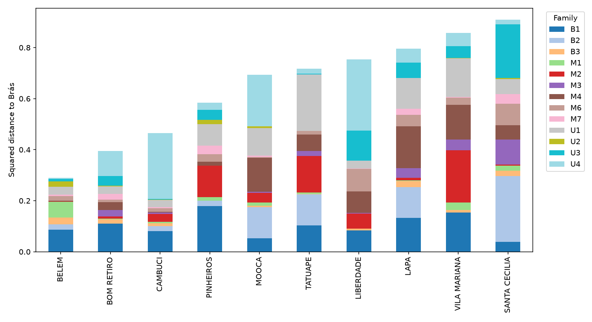
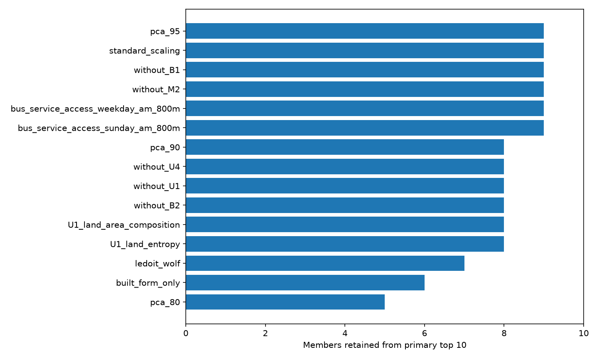
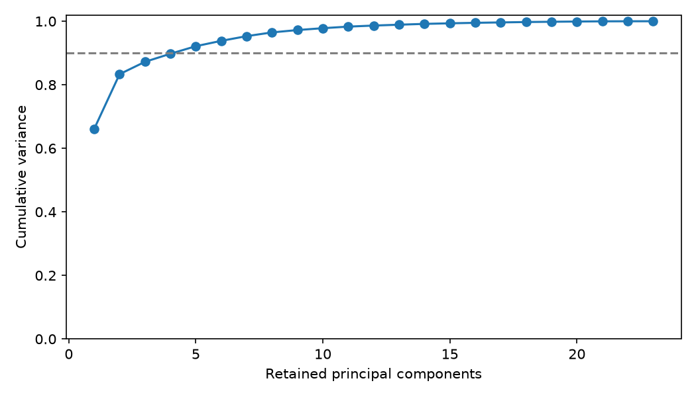

# Corrected SP urban similarity model — v2

The original v1 primary metric is preserved. The v2 release fixes input validation, PCA labeling, normalized weights, row alignment, CLI dependencies and persisted provenance, and executes the previously missing sensitivity experiments. It is a descriptive district similarity model, not a causal or predictive validation of urban equivalence.

Primary cohort: 96 districts; Brás 10; 13 families; 23 original coordinates. Executed 577 scenarios, including 500 seeded weight perturbations, source substitutions, family exclusions, 32 subprefeitura fit exclusions, PCA and regularized Mahalanobis.

## Primary ranking

| district_id | distance | rank | district_name |
|---|---|---|---|
| 08 | 0.5376137209266624 | 1 | BELEM |
| 09 | 0.6278885542753905 | 2 | BOM RETIRO |
| 14 | 0.6817582390741499 | 3 | CAMBUCI |
| 62 | 0.7644821255777918 | 4 | PINHEIROS |
| 53 | 0.832455503724011 | 5 | MOOCA |
| 80 | 0.8465572731550411 | 6 | TATUAPE |
| 49 | 0.8680252758212661 | 7 | LIBERDADE |
| 48 | 0.8919133928654407 | 8 | LAPA |
| 90 | 0.9258133210283097 | 9 | VILA MARIANA |
| 69 | 0.9536581158897263 | 10 | SANTA CECILIA |

## Robustness findings

Across source substitutions, top-10 retention ranges from 8 to 10 of the original ten. Weight-stable candidates (at least 80% top-10 inclusion in the prespecified weight experiments): 9. These frequencies describe a designed perturbation set, not statistical confidence or probabilities of true equivalence.

| scenario | kind | spearman | top10_overlap | max_absolute_rank_shift |
|---|---|---|---|---|
| pca_80 | metric | 0.9473964165733483 | 5 | 30 |
| built_form_only | family_exclusion | 0.9130739081746919 | 6 | 38 |
| ledoit_wolf | metric | 0.7439529675251959 | 7 | 62 |
| U1_land_area_composition | representation | 0.9746080627099665 | 8 | 22 |
| U1_land_entropy | source | 0.9716405375139978 | 8 | 23 |
| pca_90 | metric | 0.9954787234042554 | 8 | 11 |
| without_B2 | family_exclusion | 0.9980263157894738 | 8 | 6 |
| without_U1 | family_exclusion | 0.9673012318029116 | 8 | 25 |
| without_U4 | family_exclusion | 0.9655375139977604 | 8 | 38 |
| bus_service_access_sunday_am_800m | source | 0.99738241881299 | 9 | 8 |
| bus_service_access_weekday_am_800m | source | 0.9977463605823069 | 9 | 7 |
| pca_95 | metric | 0.9978303471444568 | 9 | 7 |
| standard_scaling | scaling | 0.999020156774916 | 9 | 6 |
| without_B1 | family_exclusion | 0.9794232922732363 | 9 | 13 |
| without_M2 | family_exclusion | 0.991545352743561 | 9 | 14 |
| B1_gross | source | 0.9999720044792834 | 10 | 1 |
| M2_0m | source | 0.9997900335946249 | 10 | 3 |
| M2_10m | source | 0.9994400895856663 | 10 | 3 |
| M2_20m | source | 0.9985862262038073 | 10 | 8 |
| M6_observed_only | source | 0.9995660694288914 | 10 | 3 |

Numerical source substitutions reuse the primary scalar transforms and family calibrations. U1 composition replacements fit a new representation. Fit-cohort, scaling and covariance/PCA alternatives are separate experiments. Negative weights are rejected and every weight scheme sums to one. Subprefeitura exclusions change the fitting cohort and then score all 96 districts; they are influence tests, not prediction accuracy.

## PCA and interpretation

PCA is fitted to the already weighted 23-coordinate embedding. Correct feature labels follow the embedding column order. Full unwhitened PCA preserves primary distances; truncation changes the metric while retaining its initial weighting assumptions. Mahalanobis uses Ledoit–Wolf regularization and does not imply exact equal-family influence. Loadings describe variance, not causal importance. Ward results in the notebook are descriptive, not independent confirmation of real urban classes.

## Validation and limitations

Checked finite values, identities, cross-file agreement, transform serialization, composition sums, contribution reconstruction, symmetric/nonnegative distances, every triangle inequality, exact embedding equivalence, full-PCA distance conservation, positive covariance, source hash preservation and reopened EPSG:31983 GeoPackage. Automated regression tests and the separate model audit cover the original defects. Complete numerical checks do not establish independent empirical truth.

U2 still leaves 508,844 jobs unlocated in the primary scenario. M2 remains the accepted 5 m structure-exclusion proxy; M6 includes Local imputation. Cadastral entity/floor/use semantics, mixed source years, district scale and Euclidean bus access remain limitations. The 125 m population-support experiment covers only three pilots; full-city refinement and 250/500 m morphology grids remain deferred source work.

## Executed tasks and provenance

1. Validated the immutable attribute release and exact district/feature identities.
2. Fitted scalar transforms and M6 composition through shared tested modules; saved fit/apply state.
3. Computed calibrated family distances, an exact embedding, rankings and signed profile differences.
4. Ran source/representation, weighting, omission, spatial-fit, PCA and covariance scenarios with saved specifications.
5. Exported family contributions, source-quality annotations, distributions, maps, metadata and validation evidence.
6. Preserved the original v1 outputs for independent comparison.

Run metadata and full scenario fitted states are under `analysis/work/runs/sp_urban_model_v2/`. The manifest hashes source files, executable code, configuration and environment. Completed runs verify output hashes and reject changed signatures; changed inputs or methods require a new run ID. No pedestrian outcome enters the features.

The next cross-city step is the Chicago harmonization plan, not applying the current SP feature names to unmatched Chicago sources.
