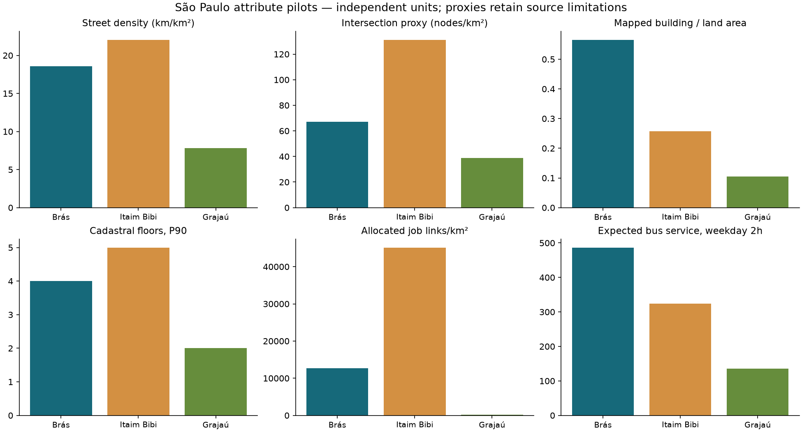

# São Paulo district attributes — N10 construction report

Run `sp_attributes_2026_09_11_v1`, completed 11 September 2026. The user authorized construction after approving M2/M6 and accepting the recommended U2 policy. This release contains **96 districts, 77 attributes/diagnostics/sensitivity columns, and 23 primary candidate columns across 13 families**. M5/U5 are excluded. The long table has **7,392 rows**. No similarity model, fitted scaling, PCA or ranking has been produced.

## Deliverables and use

- [attributes_long.parquet](../tables/attributes_long.parquet) and [CSV](../tables/attributes_long.csv): one district/feature row with value, unit, numerator, denominator, source version/period, coverage definition, entity/missing counts, method, quality status and primary flag.
- [attributes_wide.csv](../tables/attributes_wide.csv) / [Parquet](../tables/attributes_wide.parquet): all 77 numeric columns plus district ID/name.
- [attributes_primary.csv](../tables/attributes_primary.csv): 23 raw primary candidate columns plus ID/name. These are not scaled model inputs; the six M6 shares sum to one and must be handled compositionally or have one redundant column removed during modeling.
- [attribute_dictionary.csv](../tables/attribute_dictionary.csv): family, units, primary flag and method/coverage definitions.
- [sao_paulo_district_attributes.gpkg](../spatial/sao_paulo_district_attributes.gpkg): 96 district geometries and all numeric columns, EPSG:31983.
- [validation.json](../validation/checks/validation.json), [release_review.json](../validation/checks/release_review.json), [primary_feature_summary.csv](../validation/tables/primary_feature_summary.csv), [outlier_review.csv](../validation/tables/outlier_review.csv), and [quality_status_summary.csv](../validation/tables/quality_status_summary.csv).

Read district IDs as strings, e.g. `pd.read_csv(path, dtype={"district_id": str})`, to preserve leading zeros. Join metadata from the long table; the numeric-only wide tables cannot express source limitations by themselves.

## Family definitions implemented

| Family | Primary columns | Implemented measure |
|---|---|---|
| M1 | 1 | Canonical source street length / gross district area; source carriageways retained; shared boundary length owned once by ascending district ID. |
| M2 | 1 | Selected three-arm planar nodes farther than 5 m from PONTE/VIADUTO/TUNEL / gross area. Other distances are sensitivity columns. |
| M3 | 2 | Whole Quadra block area distributions; primary median and IQR of natural-log area. |
| M4 | 4 | Median/IQR of 4πA/P² compactness (holes included in perimeter) and minimum-rectangle elongation. |
| M6 | 6 | Observed and model street-class shares; all unclassified Local. Imputed share retained. |
| M7 | 1 | Unique accepted cadastral entity count / gross area; whole-parcel log-area diagnostics. |
| B1 | 1 | Footprint union clipped to land / land area; gross-area and overlap-excess diagnostics. |
| B2 | 2 | Median/P90 of one eligible positive cadastral floor report per entity; P75 and missing coverage retained. |
| B3 | 1 | Unique fiscal-unit constructed-area sum / land area; no ideal-fraction reapplication. |
| U1 | 1 | Fixed-seven-category entropy and shares; entity-count primary, entity-land-area sensitivity; unknowns excluded from entropy with coverage retained. |
| U2 | 1 | area_first allocated RAIS job links / gross area; 508,844 unlocated jobs kept outside primary district totals. Nine alternative scenarios retained. |
| U3 | 1 | Area-allocated census population / gross area; outside municipal residual retained. |
| U4 | 1 | Population-weighted expected bus supply, maximum reachable stop service per route/direction then sum; 400 m weekday primary, 800 m and weekend sensitivities. |

## Construction, issues and tests

Preparation is frozen in `sp_prep_2026_09_10_v3`; approved M2/M6 overlays and U2 experiment allocations are bound in the construction config. Original raw data and both historical preparation runs were verified unchanged. The runner validated Brás, Itaim Bibi and Grajaú first, then computed all districts. Per-district building/access outputs are checkpointed; source/config changes require a new run ID.

B1 reads the existing indexed Overture GeoPackage, not another cloud download. Within each district, exact footprint intersections are unioned inside disjoint 2 km tiles and summed; clipping to land excludes water. This prevents overlapping footprint polygons from inflating coverage. Footprints are selected spatially, not only from the district owning their whole-object ID, so cross-boundary footprints contribute their actual clipped area.

U4 intersects a fixed 250 m metric grid (origin 0,0) with each census sector and district. Each nonempty piece receives a within-polygon representative point and population proportional to its share of source-sector area. This conserves district allocated population but assumes uniform distribution within sectors. Stops outside the reporting district remain eligible. Frequency-based service is expected service from the prepared GTFS scenarios, not passenger counts or a walking-network route calculation.

Two implementation errors were caught before release: GeoPandas' `.length` property bypassed a same-named clipped-length column, causing M6 shares not to sum to one; explicit column indexing corrected it. GEOS also rejected mixed point/line boundary differences; filtering zero-dimensional contacts before line subtraction corrected the dimension issue without removing measurable street length. The final citywide audit initially differed by 40.00085 m: two source edges retrace 40.00088 m of their own linework. Polygon intersection removes these duplicate traversals, whereas the optimized audit initially measured untouched interior lines. Normalizing each non-simple source edge independently aligns the audit with geometric length, while retaining separate source edges/carriageways. The district attributes required no numerical change; the independent audit now reconciles within centimetre tolerance.

Five synthetic tests passed: square/rectangle area and shape, entropy bounds and missing mass, footprint union conservation across tiles, shared-boundary point/line handling, and self-retraced edge normalization. Release checks cover complete/unique district-feature keys, finite values and positive denominators, fraction/entropy bounds, U1/M6 share sums, projected valid GeoPackage geometry, extensive numerators, larger-radius monotonicity and all 96 population-support reconstructions. Outlier flags identify extreme source/proxy values for review, not grounds for automatic deletion.

## Conservation and pilot results

| Quantity | Reconciled result |
|---|---|
| cadastral_floor_area_density | 581,313,100.000 |
| formal_job_density_area_first_km2 | 4,878,630.000 |
| population_density_km2 | 11,446,054.473 |
| intersection_density_proxy_5m_km2 | 106,625.000 |

Independent clipped city street length: 19,369,524.695 m; sum across districts: 19,369,524.695 m.

| Feature | Brás | Itaim Bibi | Grajaú |
|---|---|---|---|
| street_density_km_km2 | 18.5569 | 22.0608 | 7.8221 |
| intersection_density_proxy_5m_km2 | 67.2311 | 131.2636 | 38.9108 |
| building_coverage_land | 0.5658 | 0.2573 | 0.1052 |
| cadastral_floor_count_p90 | 4.0000 | 5.0000 | 2.0000 |
| formal_job_density_area_first_km2 | 12,663.6684 | 45,155.2009 | 196.7936 |
| bus_service_access_weekday_am_400m | 486.7896 | 324.4323 | 135.3794 |



A 125 m population-support refinement was tested in the pilots. It is a sensitivity reference, not ground truth:

| District | U4 at 250 m support | U4 at 125 m support | Relative change |
|---|---|---|---|
| 10 | 486.790 | 489.578 | 0.57% |
| 35 | 324.432 | 322.274 | -0.67% |
| 30 | 135.379 | 137.112 | 1.28% |

## Distribution review

The review flags **38 district/feature pairs** outside Q1−3×IQR to Q3+3×IQR; no primary column is constant. Marsilac is flagged for log block-area median and dispersion. República and Sé are flagged for expected bus supply; Bela Vista and República for cadastral floor-area density; eight districts for formal-job density. Sparse street classes account for many remaining flags, so these flags are not evidence of bad records. Zero-IQR columns are skipped by this rule; their min/max and unique-value counts remain in the summary. No rows were removed, clipped or winsorized. Review these values alongside underlying source counts and U2 scenarios before selecting model transformations.

## Executed task ledger and recovery

1. **Bind accepted inputs.** Created the versioned N10 configuration and manifest from frozen v3 preparation, v2 parcel geometry, approved M2/M6 overlays and U2 experiments. Input hashes protect against silent source changes. Raw data and both prepared baselines passed the final preservation audit.
2. **Construct reusable parcel metrics.** Projected parcel geometry areas were materialized by district and joined to accepted unique entity keys and eligible fiscal profiles. Reconciled 1,667,297 entities and 1,548,308 eligible floor profiles. Fiscal area uses accepted unique accounts, with 581,313,100 m² conserved.
3. **Implement tabular district families.** Constructed M1/M2/M3/M4/M6/M7/B2/B3/U1/U2/U3, retaining numerators, denominators, entity counts, coverage definitions and sensitivity columns. Boundary-coincident streets have deterministic single ownership; whole blocks and cadastral entities use their prepared assignments.
4. **Implement footprint coverage.** Constructed B1 through indexed footprint reads, exact district/land clipping and tiled unions. Saved each district's union and summed-footprint diagnostics and a hash-checked feature checkpoint.
5. **Implement population-weighted bus access.** Constructed U4 with saved population points and per-point service outputs for six window/radius combinations. Independently reconstructed primary U4 and population totals in all 96 districts. Tested 125 m support in Brás, Itaim Bibi and Grajaú; retained the 250 m primary support.
6. **Pilot, then municipal execution.** Validated the three pilots before releasing all districts. Reused completed B1/U4 checkpoints while correcting street audit and entity metadata issues; tabular features were recomputed. The five synthetic tests and 20 independent release-review checks passed, alongside runner validations.
7. **Package and document.** Exported long/wide/primary tables, the feature dictionary and projected district GeoPackage. Reopened the GeoPackage to check all 96 valid geometries. Saved distribution/quality summaries, diagnostics, logs, code/output hashes and updated the current handoff, implementation plan and method decisions.

The complete run is recorded in `progress.json`. The two expensive modules have per-district checkpoints under `parts/`; recovery with the same configuration skips only hash-valid outputs. A changed source or attribute definition requires a new run ID. Code is in `analysis/scripts/sp_attributes/` and the entry point is `analysis/scripts/construct_sp_attributes.py`; the final review is `analysis/scripts/review_sp_attribute_release.py`. Frozen N05/N07 acceptance failures remain historical evidence of physical-connectivity/geolocation limitations and are not overwritten to make proxies appear measured.

## Interpretation and next step

All 13 families now have constructed values under their declared methods. That does not establish complete real-world coverage. B2/B3/U1/M7 are cadastral proxies; B1 reflects mapped footprints; M2 is a structure-exclusion proxy; M6 includes assumed Local classes; U2 is partially located and geographically modeled; U3/U4 rely on population allocation. B3 district completeness is unknown and explicitly null in the coverage field; its 97.3% citywide fiscal-source match must not be treated as all-building coverage. U2's 90.56% coverage is a citywide allocation fraction, not a measured per-district completeness rate. Some other coverage fields describe eligible source records only; read `coverage_definition`.

The primary matrix includes six dependent M6 class shares and families with different column counts. N11 must choose transformations, compositional handling, family weights and covariance regularization, review outliers and test sensitivity to U2 and other proxies before calculating Brás similarity. No unlocated jobs were silently assigned to the primary matrix. Chicago comparison, robustness-grid attributes and pedestrian accessibility outcomes remain later work.

## Reproduction and continuation

```bash
.venv/bin/python analysis/scripts/construct_sp_attributes.py --phase both
.venv/bin/python analysis/scripts/check_sp_population_support.py
.venv/bin/python analysis/scripts/plot_sp_attribute_qa.py
.venv/bin/python analysis/scripts/review_sp_attribute_release.py
```

Configuration: `analysis/config/sp_attributes_2026_09_11.json`; current method binding: `analysis/config/sp_current_methods.json`. The runner uses `parts/<module>/<district>/checkpoint.json`; completed building/access parts are reused only when code/config/input signatures and feature-file hashes match. Tabular features are recomputed on a rerun. Keep the original run immutable when changing definitions. The final release inventory records code and output hashes. For project history and issue/decision explanations, see `analysis/notes/SP_DATA_RESOLUTION_HANDOFF.md` and `SP_METHOD_DECISIONS.md`.
