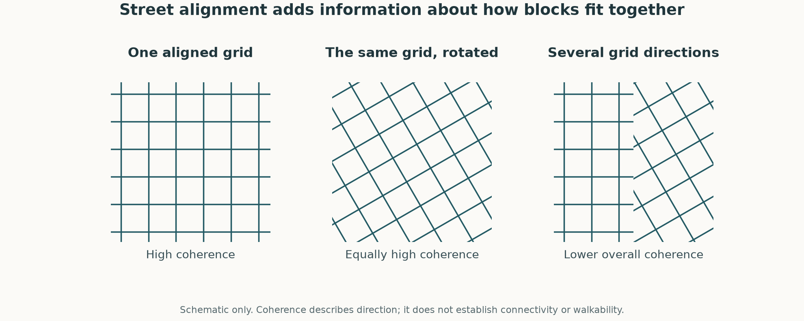

# Candidate additions for neighborhood morphology

Prepared 6 October 2026 in response to a request for new features that capture neighborhood character and can be supported in both São Paulo and Chicago. This is an exploratory proposal. Its calculations are not pre-registered acceptance tests, and it does not establish improved neighborhood matches or change the model contract.

## What the model currently captures

The [contract snapshot used in the overlap calculations](model_contract_snapshot.json) contains 12 families and 20 columns: M1 street density, M3 typical block size, M4 compactness and elongation, M6 major-road share, M7 mapped parcel density, B1 footprint coverage, BV built-weighted height, U2 registered jobs, U3 residents, U4 public transport access, U6 establishment intensity and composition, and U1 residential, industrial and institutional land shares. The initial review encountered the earlier 11-family contract; the joint review admitted those three U1 shares while this analysis was running. The saved snapshot makes the actual comparison set explicit. Paired São Paulo tables are available; cross-city acceptance, scaling and distance interpretation remain a separate stage. The historical São Paulo model is not the same specification.

Sources: [current contract](../../../config/chicago_model_v1.json), [model plan](../../../../docs/chicago/MODEL_PLAN.md), [research protocol](../../../../docs/PROTOCOL.md).

The principal gaps are relationships among the measured objects and variation within administrative areas. Two areas can share similar coverage, height, parcel density and typical block size while differing in street alignment, how buildings line streets, how much block sizes vary, or how much routes detour. Those are candidate dimensions of character; none is inherently a measure of neighborhood quality.

## Four options

| Candidate | Additional question | Data in both cities | Main reservation |
|---|---|---|---|
| Street-direction coherence | Do streets follow a common pair of perpendicular directions, or many different directions? | Frozen Overture 2026-08-19 transportation geometry; municipal geometry for comparison | Alignment is not connectivity; administrative boundaries, parallel carriageways, ramps and digitization matter |
| Variation in block size | Is the area's land distributed across similarly sized enclosures, or a mixture of small and large ones? | Existing Step 8 area-weighted log-area IQR, plus municipal and official reference IQRs | Partly repeats density and block-size level; large nonurban enclosures can dominate |
| Building presence along streets | Are buildings close to streets along much of their length, or separated by long gaps and open areas? | Overture buildings and streets; Cook footprints and imagery, São Paulo historical outlines and recent imagery for checks | São Paulo footprint omissions create false gaps; centerline distance is not setback from a curb or property line |
| Local route directness | How much farther must a route travel than the straight-line separation of its endpoints? | Overture segment connector IDs, geometry and access attributes; existing U4 network work | A missing crossing or false connection can change many routes; access and grade need validation |

### Street-direction coherence: a genuinely new model feature

Measure the direction of each straight piece between consecutive vertices of eligible road geometry, weight by its mapped length, and calculate:

`R4 = hypot(sum(length * cos(4 * angle)), sum(length * sin(4 * angle))) / sum(length)`.

This experimental measure ranges from 0 to 1. A perfect orthogonal grid has R4=1, even if the entire grid is rotated. Several different grid orientations or curving streets can reduce it. An exclusively parallel network can also have R4=1; therefore it must be called direction coherence, not proof of a connected grid. R2, the corresponding second angular moment, is retained as a diagnostic for dominant parallel alignment. A low R4 is not uniquely diagnostic of organic urban development.

The calculation uses the frozen ten-class M1 universe, clips line length to the same district land, and does not use junction counts or close polygons. A companion omits motorway, trunk and link segments. The municipal comparison uses the same source filters as Step 6; São Paulo's reference street universe is not perfectly equivalent to the Overture class filter. Missing line-end joins can affect directions slightly but do not trigger the abrupt polygon-merging failure seen in Step 8.

This exact R4 implementation is an exploratory choice, not Boeing's published entropy-based orientation-order formula. The broader justification for using street orientation as a distinct morphological description is supported by [Boeing's orientation study](https://arxiv.org/abs/1808.00600).

Overture segments for both cities are already saved with release and provenance manifests. Both cities also have municipal linework: [Chicago Street Center Lines](https://data.cityofchicago.org/Transportation/Street-Center-Lines/6imu-meau) and [GeoSampa Logradouro](https://prefeitura.sp.gov.br/web/licenciamento/w/servicos/341585). Step 6 street-length rank agreement is 0.958 and 0.975. That establishes useful source evidence for coverage, but does not itself validate angles or connectivity. [Step 6 evidence](../m1_m6_step6_2026_10_06/README.md).

Before admission, investigate 250 m and 500 m supports, digitization/generalization sensitivity, divided-road weighting, and within-city spread relative to source disagreement. A global direction summary cannot locate the different patterns within a district. Fixed-size windows would help distinguish one common district grid from several locally coherent grids. The neighborhood support must be the same in both cities.

**Exploratory results across all 173 units.** These are descriptive comparisons selected for this proposal, without pre-registered acceptance thresholds.

| Measure | Chicago (77) | São Paulo (96) |
|---|---:|---:|
| Overture vs municipal R4, Spearman | 0.988 | 0.991 |
| Median absolute source difference on the 0–1 scale | 0.010 | 0.008 |
| Maximum absolute source difference | 0.124 | 0.053 |
| Largest source-dependent rank movement | 14 places | 18 places |
| All ten classes vs excluding motorway/trunk/links, Spearman | 0.959 | 0.974 |
| R4 p10 / p50 / p90 | 0.569 / 0.850 / 0.984 | 0.054 / 0.167 / 0.371 |
| R4 vs M1 street density, Spearman | -0.185 | 0.349 |
| R4 vs M3 typical block size, Spearman | -0.184 | -0.503 |
| R4 vs M4 compactness, Spearman | 0.386 | 0.691 |
| Largest absolute correlation with any current primary column | 0.655 (M6) | 0.691 (M4 compactness) |

Illustrative measured values: Brás 0.363 (municipal 0.358), Loop 0.850 (0.836), West Englewood 0.995, Forest Glen 0.234, Jardim Paulista 0.784 and Grajaú 0.016. These are examples of direction patterns, not ordinal judgments about neighborhood quality. They have not received a new imagery audit here.

The largest source rank movements are Washington Park (14) and Consolação (18); Calumet Heights has Chicago's largest absolute difference (0.124). These cases should return for map review. Overall agreement can conceal unstable positions where many areas have similar values. The large gap between the cities also requires attention: the feature could dominate city separation even while adding useful within-city variation. Preserve a fixed street-morphology budget in a later model comparison and inspect both effects.

These results make **street-direction coherence the strongest genuinely new feature candidate from this review**. They show reproducible measurements across two street sources and partial rather than near-complete overlap with individual existing columns. They do not show that all existing features jointly fail to explain it, establish independent source truth, or demonstrate improved nearest-neighbor matches.

### Block-size variation: an existing diagnostic worth considering as an input

Use `ov_m3_wiqr_ln = Q75(log area) - Q25(log area) = log(Q75(area) / Q25(area))` under the Step 8 area weights. This is already computed, but is not among the primary M3 columns. It would be new to the main distance, rather than a new dataset or newly invented metric.

For example, two hypothetical areas may both have a median block of 20,000 m². One could have quartiles 18,000 and 22,000 m², and another 10,000 and 40,000 m². The median hides their different grain distributions. The IQR distinguishes them. It does not reveal where the large and small blocks are located.

Exploratory calculations from the saved Step 8 table:

| Rank association | Chicago | São Paulo |
|---|---:|---:|
| Overture block-size IQR vs official-block IQR | 0.865 | 0.921 |
| Overture block-size IQR vs municipal-line IQR | 0.936 | 0.350 |
| IQR vs typical block size | 0.600 | 0.753 |
| IQR vs street density | -0.618 | -0.755 |
| IQR vs footprint coverage | -0.364 | -0.748 |

The municipal-line failure in São Paulo persists. The official references are Census blocks in Chicago and quadra viária in São Paulo, and they differ in physical meaning; Census/OSM source lineage is not fully independent. These comparisons are encouraging rank evidence, not physical truth or a pass under a pre-registered rule. Bivariate correlations cannot establish incremental information beyond all current features jointly.

If retained, median and IQR should share M3's existing family budget initially. Treating the IQR as an additional full family would change the importance assigned to block morphology. Check whether high dispersion is primarily driven by airports, parks, industrial sites, rural land, or incomplete face coverage. The IQR inherits the whole-face and land-weighting choices; it must not be presented as a statistic limited to ordinary residential blocks.

### Building presence along streets: strongest immediate connection to streetscape character, less secure source support

Sample ordinary street geometry at equal distances and measure building presence and distance on each side. Potential summaries are the share of sampled street sides encountering a mapped building within a predeclared distance, and the length of uninterrupted stretches without such a building. Use footprint unions to reduce dependence on how a roof is split into records. Exact sampling intervals and distance thresholds require a fixed proposal and sensitivity analysis before admission.

This can distinguish continuous street edges from isolated buildings surrounded by open space at similar overall B1 coverage. [Momepy Streetscape](https://docs.momepy.org/stable/api/momepy.Streetscape.html) supplies an established approach based on sightlines. Height-to-width ratios would require additional building-height validation; GHSL's 100 m height is not a measured facade height.

The data risk is material. The project's [B1 audit](../b1_step4_2026_10_05/README.md) identifies uneven footprint omissions in São Paulo, and its [dated imagery follow-up](../b1_geosampa_overture_overlap_2026_10_05/README.md) confirms both missing Overture roof geometry and obsolete municipal outlines. GeoSampa's vector source derives from 2004 photography; 2007/2014 database dates do not make it contemporary. Microsoft is not an independent referee because of shared lineage. [Overture's documentation](https://docs.overturemaps.org/guides/buildings/) also notes that footprints may be roofprints and that precision differs by source.

Missing footprints would make the same area appear both less covered under B1 and less continuously built along streets. That would amplify a shared mapping error. This candidate deserves a paired imagery pilot, but current availability is insufficient to call it reliably comparable across both cities.

### Local route directness: a useful topology proposal requiring a stronger network check

For pairs of locations at comparable straight-line separations, measure network distance divided by straight-line distance. Keep endpoints and separation bands sampled by the same rules in both cities, and keep disconnected pairs visible rather than silently discarding them. Use a buffered graph so routes can cross district boundaries. The concept is supported by [research comparing walking and driving circuity](https://arxiv.org/abs/1708.00836).

The existing U4 calculation provides a starting point: [its report](../u4_ptal_step2_2026_10_05/README.md) gives main-component node shares of 99.3% in Chicago and 98.5% in São Paulo. Those percentages do not establish correct crossing permissions or local route geometry. The current graph builder reads road classes, geometry and connector IDs but does not read the access-restriction field. A new directness feature therefore needs its own access and connection audit. [Overture defines connections through segment connector references](https://docs.overturemaps.org/guides/transportation/), rather than every geometric crossing.

M2 remains excluded; this proposal is not an authorization to rebuild junction density. Also retain the research protocol's separation between morphological selection and the later pedestrian-condition outcomes. If route directness becomes an outcome of interest, conditioning neighborhood matching on it could remove the contrast the study intends to examine.

## What would count as an improvement

Agreement with another source and low pairwise correlation are necessary evidence to consider, but neither proves improved analogues. Before any new admission test, fix source-error tolerances and use contrasting independent map/imagery cases that were not selected to obtain a desired ranking. Examine combined predictability from existing features, stability under source and spatial-support choices, and whether additional differences correspond to recognizable urban form.

At the authorized model-comparison stage, compare the baseline with one addition at a time while holding the intended family budgets constant. Report which neighbor matches change and why. A changed or stable ranking alone is not proof of improved validity. Do not admit every candidate simply because it can be calculated, and do not use separate city scaling to conceal source errors.

## Recommendation and reproducibility

1. Prioritize street-direction coherence for a predeclared validation pilot, especially local support, source-disagreement cases, and highway/parallel-carriageway sensitivity. It is a morphological feature; no physical-junction count is restored.
2. Consider block-size dispersion as a second M3 coordinate within the same family budget. Its source agreement is encouraging, but its overlap and nonurban-face influence deserve review.
3. Keep building presence along streets as a later paired imagery pilot and route directness as a later graph-validation proposal. Their conceptual value is substantial; present source support is less secure for those exact measurements.

Run from the repository root: `.venv/bin/python analysis/results/SP_CHI/feature_options_2026_10_06/explore_candidates.py`. It reads the saved contract snapshot, calculates the two source direction measures and the road-universe sensitivity, and writes descriptive correlations. It does not fit a similarity model or apply acceptance thresholds.

- [Source register](source_register.json): source and table hashes.
- [Summary](exploratory_summary.json): both candidate comparisons.
- [Direction values with names](direction_coherence_exploratory_named.csv): measured values and source-dependent rank shifts.
- [All primary-column correlations](candidate_existing_correlations.csv): individual overlaps in each city.
- [Construction checks](construction_checks.json): 173 unique units, no missing values, R2/R4 within 0–1, M1 street lengths reproduced within 1.14 × 10⁻¹³ km, and analytic rotation/segmentation examples. These verify arithmetic and support, not feature acceptance.

The script uses the Step 6 repair for three nonfinite vertices in the São Paulo municipal lines. Current municipal and Overture sources may share lineage, so their agreement is not a wholly independent accuracy estimate. Scripts and result files are exploratory artifacts; the authoritative contract was not edited by this analysis.
