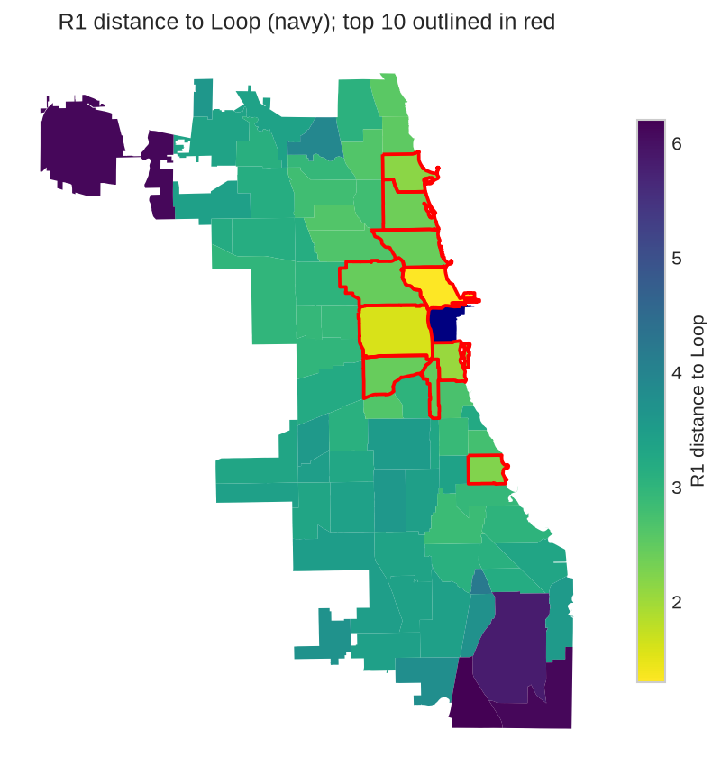
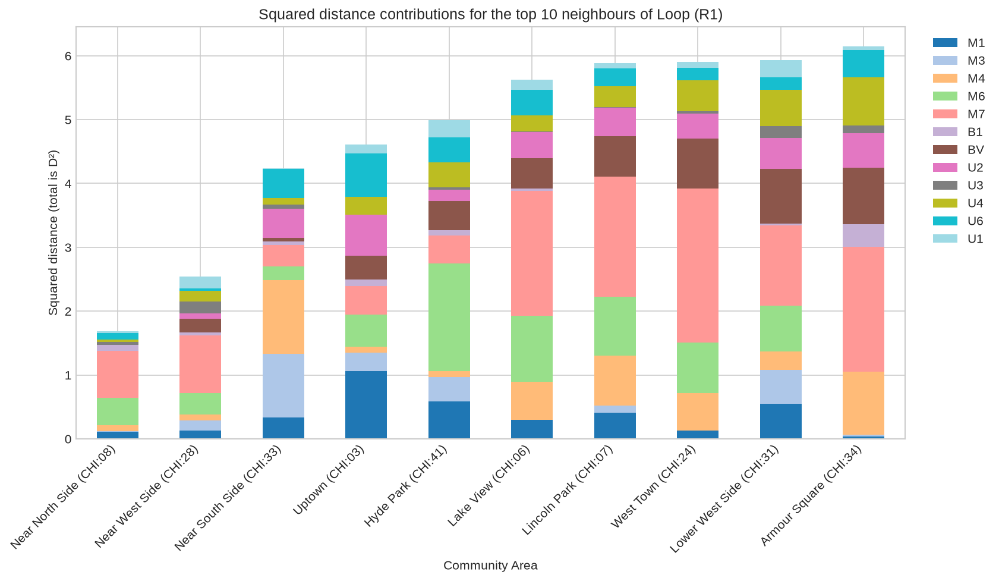
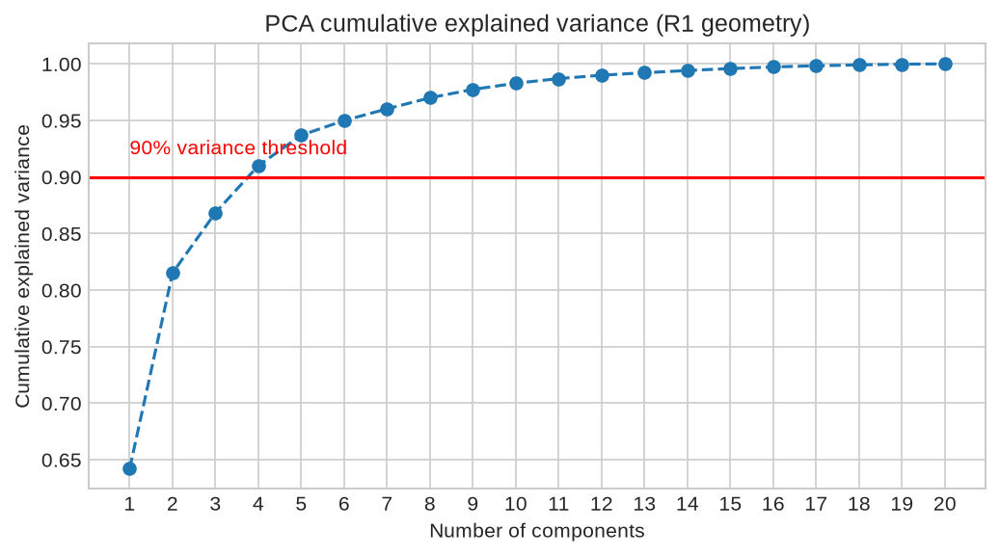
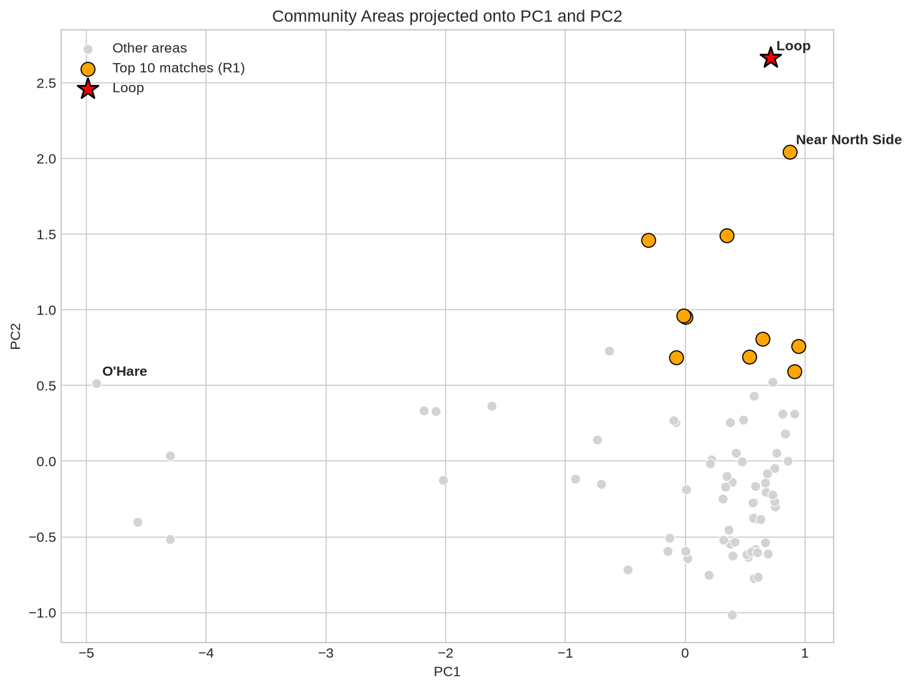
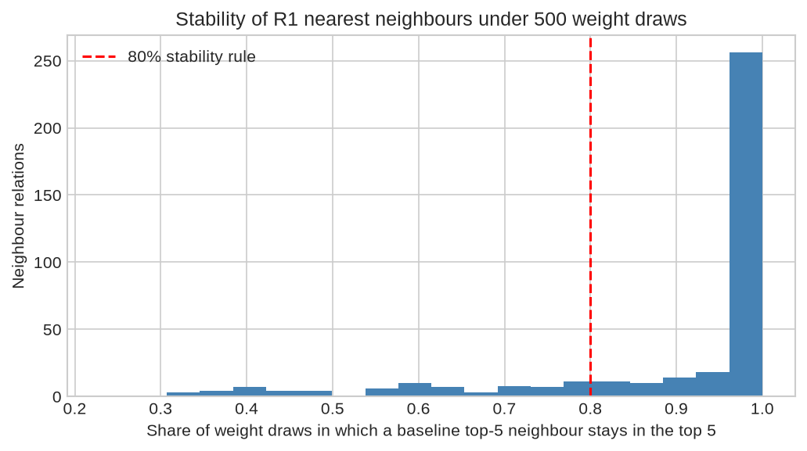
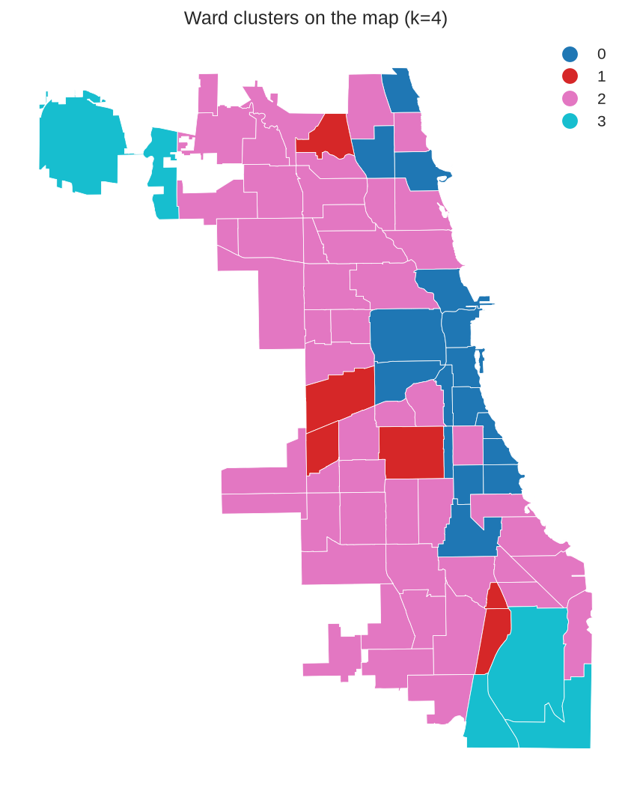

# Chicago urban similarity model (`chicago_model_v1`): methodology and results

**Status:**
- Contract frozen and fit authorized on 6 October 2026 (decision J-10). Any change is `chicago_model_v2`.
- **Contract:** [`analysis/config/chicago_model_v1.json`](../../analysis/config/chicago_model_v1.json).
- **Code:** [`analysis/scripts/chicago_model.py`](../../analysis/scripts/chicago_model.py).
- **Notebook (builds the model, all plots and tables):** [`analysis/chicago_model_analysis.ipynb`](../../analysis/chicago_model_analysis.ipynb).
- **Outputs:** [`analysis/results/Chicago/chicago_model_v1_2026_10_06/`](../../analysis/results/Chicago/chicago_model_v1_2026_10_06/README.md).
- **Decision record:** [MODEL_PLAN.md](MODEL_PLAN.md).

## 1. What the model answers

**The question.** Which of Chicago's 77 Community Areas resemble each other in urban form and function?

**What it measures.** Every area is described by 20 numbers grouped into 12 feature families: street layout, buildings, and the activities and people they hold. The model turns those numbers into a **dissimilarity between every pair of areas** (a 77 × 77 matrix).

**What it reports.** For every area: its five most similar areas, which families drive each similarity, and how stable that neighbourhood is under different weightings.

**What it does not do (decision J-1).**
- **No single target.** The model is target-free. Any ranking around one area, or a typology, is read from the matrix.
- **No cross-city comparison yet.** Comparisons with São Paulo (Brás) belong to the later common stage, where cross-city levels (convention C6) are still to be decided.
- **Display reference only.** This report uses the Loop as the reference for target-based views because it is the Chicago anchor used throughout the plan. Nothing in the model depends on that choice.

## 2. Units and conventions

| ID | Convention |
|---|---|
| C1 | 77 Community Areas, EPSG:26916, IDs `CHI:01`–`CHI:77` |
| C2 | Densities divide by **land** = Community Area minus municipal water. Parks, vacant land, cemeteries and the airport stay in the denominator |
| C3 | Every family lists source, release, observation period and SHA-256. Vintages are disclosed, not aligned |
| C4 | Missing values stay missing with a reason; nothing is imputed |
| C5 | Transforms, scaling and weights are set once, jointly, at the end (this report) |
| C6 | Cross-city levels: deferred to the common stage |

**How a family was accepted:**
1. Its definition was frozen.
2. Its checks, with numeric pass rules, were approved by the user **before** the results were seen.
3. One script and one dated results folder produced the values.
4. The user signed an acceptance record ("accepted", or "accepted with stated limits").

A failed check stayed recorded as failed. Where a failure was explained, the explanation is labelled post hoc.

## 3. The features

Twelve families, 20 columns. All values are for 2020–2026 depending on the source (see the vintages).

### Street morphology

| Family | Column (unit) | What it measures | Source | Key check (pre-registered) | Main limits |
|---|---|---|---|---|---|
| **M1** street density | `m1_km_per_km2` | Street length in ten road classes per km² of land | Overture Maps segments 2026-08-19 (97.8% OpenStreetMap) | Spearman 0.958 with the city's street centerlines (rule ≥ 0.95) | Divided roads count twice; O'Hare 2.19× the city file |
| **M3** block size | `ov_m3_wmedian_ln_m2` (ln m²) | The size of the street block in which a typical m² of land sits: area-weighted median of the faces enclosed by the M1 streets | Overture streets | 0.959 with faces from the city's centerlines (≥ 0.90); 0.831 with 2020 Census blocks (≥ 0.80) | Faces include half of each surrounding street; bridges ignored; airport and rail yards read as huge blocks by design |
| **M4** block shape | `ov_m4_wmedian_compactness`, `ov_m4_wmedian_elongation` | Area-weighted medians of 4πA/P² and longest ÷ shortest side | Same faces | 0.889 and 0.810 with centerline faces (≥ 0.80) | Little variance inside the grid (most areas are 2:1 rectangles) |
| **M6** street hierarchy | `m6_major_share` | Share of street length in motorway, trunk, primary and secondary roads | Overture streets | 0.815 with the city's street classes (≥ 0.80) | OpenStreetMap tagging |
| **M7** mapped ground-parcel density | `m7_parcels_per_km2` | Ground parcels per km² of land | Cook County 2024 parcels (air-rights parcels dropped) | 0.998 with Assessor 10-digit PINs (≥ 0.95) | Record consistency, not truth; a condominium tower is one parcel (Loop reads coarse); O'Hare's DuPage part has no Cook parcels |

### Built form

| Family | Column | What it measures | Source | Key check | Main limits |
|---|---|---|---|---|---|
| **B1** footprint coverage | `B1_coverage_land` | Union of building footprints ÷ land | Overture buildings 2026-08-19 (99.4% OpenStreetMap) | 0.983 with Cook 2022 LiDAR footprints | Mapped, not surveyed; median 8.5% below LiDAR |
| **BV** vertical form | `bv_height_built_m` (m) | Built-surface-weighted building height | GHSL R2023A (2018 heights, 100 m cells) | 0.852 with Cook 2022 LiDAR height | Modelled; tall areas compressed (Loop reads 42 m) |

### Use and activity

| Family | Column | What it measures | Source | Key check | Main limits |
|---|---|---|---|---|---|
| **U2** job density | `u2_jobs_land_km2` | Registered jobs per km² of land | LODES 2023 (jobs at the declaring establishment) | Source audit; allocation sensitivity | Not where people physically work; partly synthetic |
| **U3** resident density | `u3_acs_land_km2` | Residents per km² of land | ACS 2020–2024 5-year, allocated block group → 2020 block → area | CV gate 12% (Burnside, Fuller Park exceed) | Pooled 2020–2024 estimate |
| **U4** public transport accessibility | `u4_ptai_avg_resident` | PTAL Access Index (TfL method) for bus, 'L' and Metra, averaged over residents | CTA and Metra GTFS, weekday 08:15–09:15 | Method reproduces the TfL worked example | Service near home, not where it goes; grows with route count |
| **U6** activity composition | `u6_log_intensity` + five `u6_clr_city_*` | Establishments per 100 dwellings (log), and the mix of food & drink, retail, services & offices, making & storing, institutions | Overture places 2026-08-19 (closed and untyped excluded); ACS dwellings | 0.980 and 0.875 with City business licences (≥ 0.80) | A kiosk counts like a department store; formal and online bias; flagged: Oakland, Burnside, Riverdale (< 100 establishments) |
| **U1** land-use composition | `p_residential`, `p_industrial`, `p_institutional` | Shares of classified occupied land in residential, industrial and institutional use | CMAP Land Use Inventory 2023 | Admitted at the final review (J-3, below) | O'Hare missing (4.9% classified land); primary use per lot |

### Not in the model, by decision

| Item | Reason |
|---|---|
| M2 junction density | Excluded by the user |
| B2 reported floors, B3 constructed floor area | No defensible Chicago source |
| U1 mix score (entropy) | Dropped: blind to vertical mixing, it ranked the busiest mixed centres as least mixed |
| U1 commerce land share | Failed admission: correlates 0.708 with U6 intensity in São Paulo |

## 4. How the model is calculated

Think of each area as a point in a 20-dimensional space. Two areas are similar when their points are close. The steps below decide what "close" means, so that no family dominates because of its units, its spread or its number of columns.

**Step 1, transforms (J-5).**
- Natural log for strictly positive amounts on a ratio scale: U2, U3, U4, M1, M7, BV height, M4 elongation. A log makes "twice as dense" the same step everywhere.
- Identity for shares, indices and log-ratios: B1, M6, M4 compactness, M3 (already ln m²), U6, U1.

**Step 2, scaling (J-6).** Each transformed column is standardized on the 77 areas, $z = (t - \bar t)/s$ with the population standard deviation, and **capped at ±3**.
- *Why not the median/IQR scaling of the São Paulo model.* Chicago's grid is uniform: for M4 compactness the middle half of areas spans only 0.016. IQR scaling would turn rounding-level differences into large ones (16 areas beyond 3 IQR units, the largest at 18.8).
- The cap then stops one extreme area from dominating. Capped areas:
  - M3: South Deering, Riverdale, Hegewisch, O'Hare.
  - M1: South Deering, Hegewisch, O'Hare.
  - BV: Near North Side, Loop.
  - The Loop also on U2, U4, U6 intensity and M6.

**Step 3, composition (U6).** The five activity classes are compared with the **Aitchison distance**: Euclidean distance on centred log-ratios $\mathrm{clr}_k = \ln(n_k + 0.5) - \tfrac15\sum_j \ln(n_j + 0.5)$. They are left unscaled, because standardizing log-ratios one by one would break their geometry.

**Step 4, blocks and calibration (J-7).**
- Each family is one block. U6 is two (intensity and composition), each with half of U6's budget.
- For block $b$ with $c_b$ columns, $m_b(d,e) = \tfrac{1}{c_b}\sum_j (x_{dj} - x_{ej})^2$. Averaging over columns means a three-column family does not count three times.
- Each block is divided by $\beta_b$, its median positive value over all pairs, so that every block contributes on a common scale.

**Step 5, distance.** Every family has the same budget $w_f = 1/12$; $s_b$ is the block's share of its family:
$$D(d,e)=\sqrt{\frac{\sum_b w_{f(b)}\,s_b\,m_b(d,e)/\beta_b}{\sum_{b\ \text{available for}\ d,e} w_{f(b)}\,s_b}}$$
- The denominator is 1 for every pair except those involving O'Hare, whose U1 shares are missing: those pairs use the 11 families both areas have (J-8).
- This is the São Paulo v2 "weighted Euclidean" implementation. It has an exact Euclidean embedding, which the PCA and clustering steps use.

**Worked example (Loop vs Near North Side, R1).** $D^2 = 1.689$, so $D = 1.300$.

| Family | Part of $D^2$ | Share |
|---|---|---|
| M7 parcels | 0.731 | 43% |
| M6 major streets | 0.435 | 26% |
| M1 | 0.109 | 6% |
| U6 | 0.106 | 6% |
| B1 | 0.099 | 6% |
| M4 | 0.089 | 5% |
| U3, U4, U1, M3 | 0.012–0.040 each | — |
| U2, BV | 0 | — |

What it shows:
- The two areas differ mainly in parcel grain (the Loop's towers sit on few large parcels) and major-street share.
- They are identical on jobs and height **because both are capped at +3**. The Loop has 4.1× Near North Side's job density (122,514 vs 29,855 per km²) and taller buildings (42 vs 28 m), and the cap hides that. See the limits.

## 5. Pre-registered checks at the final review

**J-3, U1 admission.** A land share enters only if its largest absolute Spearman correlation with the U6 coordinates, B1 and M1 is below 0.70 in **both** cities. Areas under 10% classified land are left out: O'Hare, Marsilac, Parelheiros.

| Share | Chicago max \|ρ\| (with) | São Paulo max \|ρ\| (with) | Result |
|---|---|---|---|
| Residential | 0.231 (U6 intensity) | 0.588 (U6 intensity) | admitted |
| Commerce | 0.593 (food & drink log-ratio) | **0.708** (U6 intensity) | not admitted |
| Industrial | 0.662 (making & storing) | 0.692 (making & storing) | admitted |
| Institutional | 0.503 (institutions) | 0.287 (U6 intensity) | admitted |

**J-4, redundancy.** No two families correlate at |ρ| ≥ 0.90 in Chicago, so no budgets were merged. The strongest pairs: BV height and U4 transit 0.88; B1 coverage and U3 residents 0.80; M3 block size and M7 parcels −0.73; U2 jobs and U6 intensity 0.71 ([heatmap](../../analysis/results/Chicago/chicago_model_v1_2026_10_06/figures/spearman_heatmap.png)).

## 6. Results

### 6.1 R1: equal weights (primary)

The Loop's ten most similar areas, with distance:

| Rank | Area | Distance |
|---|---|---|
| 1 | Near North Side | 1.300 |
| 2 | Near West Side | 1.594 |
| 3 | Near South Side | 2.058 |
| 4 | Uptown | 2.148 |
| 5 | Hyde Park | 2.233 |
| 6 | Lake View | 2.373 |
| 7 | Lincoln Park | 2.427 |
| 8 | West Town | 2.430 |
| 9 | Lower West Side | 2.435 |
| 10 | Armour Square | 2.479 |

**Face validity.** Every area's five neighbours are in `tables/neighbours_R1.csv`. Examples:

| Area | Five nearest (R1) |
|---|---|
| Beverly | Morgan Park, Forest Glen, Ashburn, Norwood Park, Mount Greenwood (single-family bungalow belt) |
| West Town | Logan Square, Avondale, North Center, Lincoln Park, Lake View (northwest-side grid) |
| Archer Heights | Pullman, North Park, New City, Burnside, South Lawndale (industrial mixed areas) |
| O'Hare | South Deering, Hegewisch, Riverdale, North Park, Pullman (large-land industrial or airport) |

**Which families actually drive the distances: the main caveat.**

| Family | Mean share of $D^2$ over all 2,926 pairs | Pairs where it is over half of $D^2$ |
|---|---|---|
| **M3 block size** | **0.193** | **579** |
| M6 | 0.088 | 30 |
| BV | 0.083 | 0 |
| U2 | 0.082 | 5 |
| U6 | 0.081 | 7 |
| U4 | 0.078 | 17 |
| M1 | 0.074 | 5 |
| M7 | 0.072 | 0 |
| B1 | 0.069 | 0 |
| U3 | 0.064 | 1 |
| U1 | 0.059 | 2 |
| M4 | 0.057 | 2 |

- Equal budgets make families count equally **on a typical pair**, because each block is divided by its median pairwise value. M3's values are nearly identical in the grid and extreme in a few industrial areas and O'Hare. Its median pairwise difference is therefore tiny (calibration 0.057, against 0.18–1.19 for the other blocks), and it weighs heavily whenever one of those areas is involved.
- **Effect on the results.** M3 carries 19% of all squared differences on average, against a nominal 8.3%.
- **How much this changes the answers:**
  - Removing M3 keeps 87% of every area's top five (Spearman 0.959 over all pairs).
  - A post-hoc calibration by the *mean* pairwise value, which equalizes average contributions, keeps 83% (0.968).
  - The Loop's top five is unchanged in both.
  - This is a property of the approved rule, reported rather than corrected. Changing it would be `chicago_model_v2`.

### 6.2 Principal components

Four components carry 91.0% of the variance:

| Component | Share of variance | Reading |
|---|---|---|
| PC1 | 64.2% | **Grain axis.** Correlations: M3 block size −0.99, M1 0.87, M7 0.84, M4 compactness 0.81, U3 0.78, B1 0.67, U1 industrial −0.65. Fine-grained residential grid at one end; coarse industrial and airport land at the other |
| PC2 | 17.3% | **Centrality and intensity axis.** BV height 0.89, U2 jobs 0.84, U4 transit 0.79 against U1 residential −0.59, M4 elongation −0.45. The Loop sits at the top |
| PC3, PC4 | 5.3%, 4.2% | Minor axes |

PC1's weight partly reflects the M3 calibration effect above. The non-Euclidean part introduced by O'Hare's missing U1 is negligible (negative-eigenvalue mass 0.5%).

### 6.3 R2: PCA weights

Distance on the four retained components, as in `model_analysis`. The Loop's top ten:
1. Near North Side 0.975
2. Near West Side 1.287
3. Near South Side 1.589
4. Uptown 1.937
5. Hyde Park 1.990
6. Lake View 2.046
7. Lincoln Park 2.104
8. Armour Square 2.203
9. **Edgewater 2.207** (new)
10. West Town 2.214

The first seven are identical to R1. Across the city R2 agrees with R1 at Spearman 0.990 over all pairs, and 72% of each area's top five is shared. Because the scores are unwhitened, R2 is R1 without the 9% of variance outside the first four components; it inherits R1's emphasis on the grain axis.

### 6.4 R3: without correlated features

Rule (fixed before computing): drop scalar columns while any pair has |ρ| ≥ 0.70; most such pairs first, ties broken by higher mean |ρ|, then later position. Four columns were dropped:

| Step | Dropped | Correlated partner kept |
|---|---|---|
| 1 | BV height | U4 transit (0.88) |
| 2 | M3 block size | M7 parcels (0.73) |
| 3 | B1 coverage | U3 residents (0.80) |
| 4 | U2 jobs | U6 intensity (0.71) |

After pruning, the largest remaining |ρ| is 0.695 and **eight families remain: M1, M4, M6, M7, U3, U4, U6, U1. The built-form domain disappears entirely.** Its information survives only through its correlated partners.

The Loop's top ten:
1. Near North Side 1.539
2. Near West Side 1.746
3. Near South Side 2.000
4. Uptown 2.191
5. Hyde Park 2.416
6. Lower West Side 2.459
7. Douglas 2.540
8. Armour Square 2.551
9. Greater Grand Crossing 2.560
10. Kenwood 2.600

R3 agrees with R1 at 0.963 (72% of top fives shared).

### 6.5 The three runs compared

| Runs | Spearman over all pairs | Mean shared top-5 |
|---|---|---|
| R1 vs R2 | 0.990 | 0.719 |
| R1 vs R3 | 0.963 | 0.717 |
| R2 vs R3 | 0.943 | 0.579 |

The Loop's top five (Near North Side, Near West Side, Near South Side, Uptown, Hyde Park) is identical in all three runs. Elsewhere, a quarter of neighbour relations depend on the run.

### 6.6 Stability under 500 weight draws (J-9)

Each family's budget was multiplied by a uniform factor in [0.5, 1.5], renormalized (seed 20261006).
- **80.8%** of the 385 top-five relations are stable, meaning the neighbour stays in the top five in ≥ 80% of draws.
- 23 areas have all five neighbours stable, 36 have four, 17 have three and one has one.
- The Loop's five are all stable (100%, 100%, 99.2%, 97.4%, 86.8% of draws).

### 6.7 Sensitivities (J-9; compared with R1)

| Scenario | Spearman, all pairs | Mean shared top-5 | Loop's top-5 kept |
|---|---|---|---|
| Leave one family out (range over 12) | 0.959–0.998 | 0.857–0.938 | 5 (3 without M7) |
| Equal budget per domain | 0.994 | 0.862 | 5 |
| Robust median/IQR scaling (São Paulo method) | 0.998 | 0.951 | 5 |
| Rank-normal scaling | 0.870 | 0.714 | 2 |
| Ledoit-Wolf Mahalanobis (without U1) | 0.858 | 0.551 | 3 |
| M3 unweighted median (instead of area-weighted) | **0.757** | **0.655** | 3 |
| M7 median parcel size (instead of density) | 0.993 | 0.836 | 3 |
| BV volume (instead of height) | 0.997 | 0.922 | 5 |
| U6 without places of confidence < 0.3 | 1.000 | 0.990 | 5 |
| *Post hoc:* mean calibration | 0.968 | 0.829 | 5 |

**Reading.**
- The model is robust to dropping any one family, to domain weighting, to the São Paulo scaling and to the U6 and BV alternatives.
- It is sensitive to three things:
  - **how block size is summarized** (area-weighted vs unweighted M3 are almost unrelated variables);
  - **rank scaling**;
  - **Mahalanobis**, which removes shared correlation and so likely down-weights directions several families express together, such as the grain axis.

### 6.8 Descriptive clusters (Ward)

Ward clustering on the R1 geometry gives the best silhouette at k = 4 (0.355; k = 3 is 0.355 to three decimals). This is a consistency check, not a validated typology.

| Cluster | Areas | Members (examples) |
|---|---|---|
| 0 | 16 | Loop, Near North, Near West and Near South Sides, Uptown, Rogers Park, Lincoln Square, Lower West Side, Armour Square, Hyde Park, Kenwood, Douglas, Oakland, Fuller Park, Washington Park, Greater Grand Crossing: central and lakefront areas, high transit and institutions |
| 1 | 6 | North Park, South Lawndale, Burnside, Pullman, Archer Heights, New City: mixed industrial edges |
| 2 | 51 | The residential grid of the north, west and south sides |
| 3 | 4 | South Deering, Riverdale, Hegewisch, O'Hare: large-land industrial and airport |

## 7. Limits

**What the model is.**
- It describes; it does not predict. No outcome validates the similarity itself. Validation lives in each family's checks and in the stability and sensitivity results.

**How the method weights things.**
- **Block size (M3) weighs more than its budget** (§6.1), and it drives PC1 and R2.
- **The ±3 cap hides extremes among the extremes.** The Loop and Near North Side look identical on jobs and height. The Loop's neighbours do not change without the cap (robust-scaling sensitivity), but the Loop's uniqueness is understated.
- **Equal family budgets give street morphology five of twelve weights.** Equal domain budgets change little (0.994).
- **R3 removes the built-form domain**, because B1 and BV are strongly correlated with residents and transit.

**What the data carry.**
- **Empty land counts in several densities.** Parks, vacant land and the airport lower U2, U3, M1, B1 and M7 at once (C2). No pair reached the 0.90 merge bar, but this shared signal contributes to PC1.
- **Flags travel with the results:**
  - U3: Burnside and Fuller Park exceed the 12% CV gate.
  - U6: Oakland, Burnside and Riverdale have fewer than 100 establishments; Kenwood, Hyde Park, Lower West Side, Lincoln Park and Lake View have more than 30% untyped places.
  - M7: O'Hare (its DuPage part has no Cook parcels).
  - U1: O'Hare missing.
- **Vintages differ:** Overture 2026, ACS 2020–2024, LODES 2023, CMAP 2023, Cook parcels 2024, GHSL 2018 heights.
- **São Paulo values exist for every family** but are not used here. Cross-city levels (C6) and Brás comparisons are the next stage.

## 8. Reproducing the model

1. `analysis/scripts/chicago_model.py` checks that the embedding reproduces the distance exactly and that PCA from the distance matrix equals PCA of the embedding.
2. `jupyter nbconvert --to notebook --execute --inplace analysis/chicago_model_analysis.ipynb` (from `analysis/`, repository `.venv` kernel) rebuilds every table and figure in `analysis/results/Chicago/chicago_model_v1_2026_10_06/`.
3. Inputs are read from each family's accepted table and **refused if its SHA-256 differs** from the one recorded at acceptance in the contract.
4. Random draws use seed 20261006.
