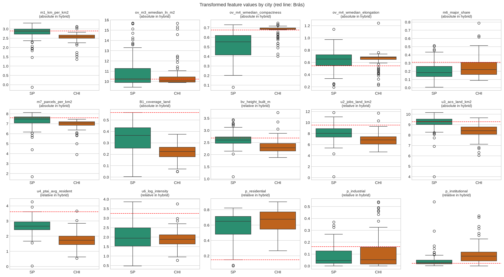
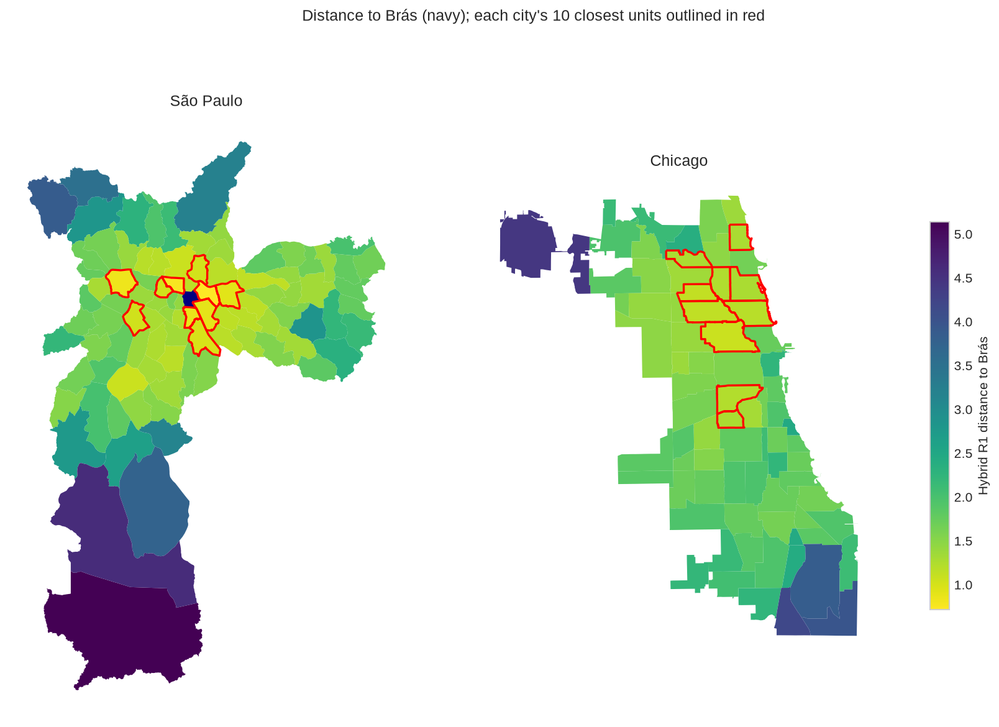
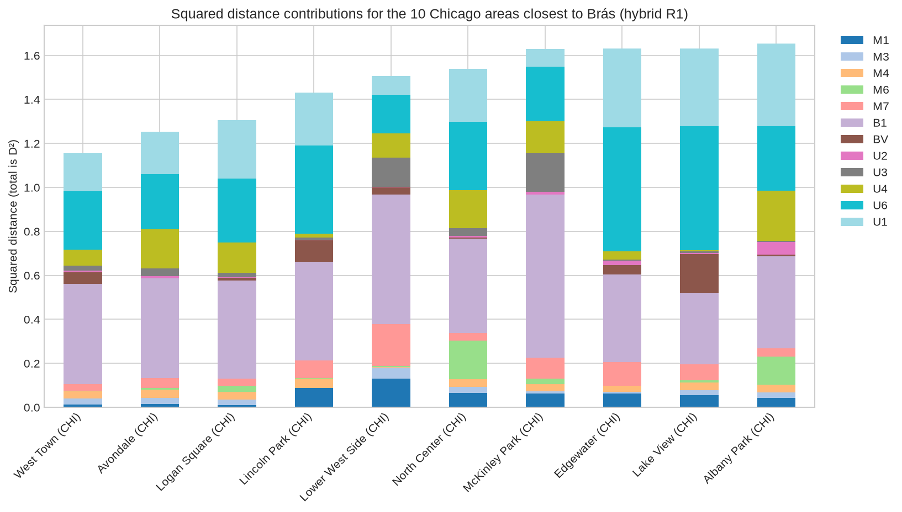
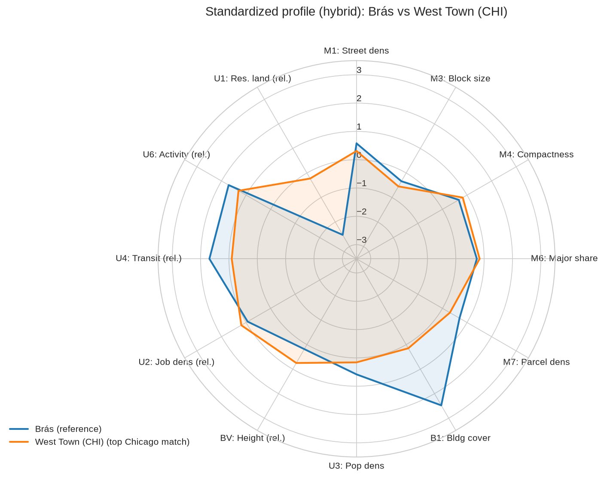
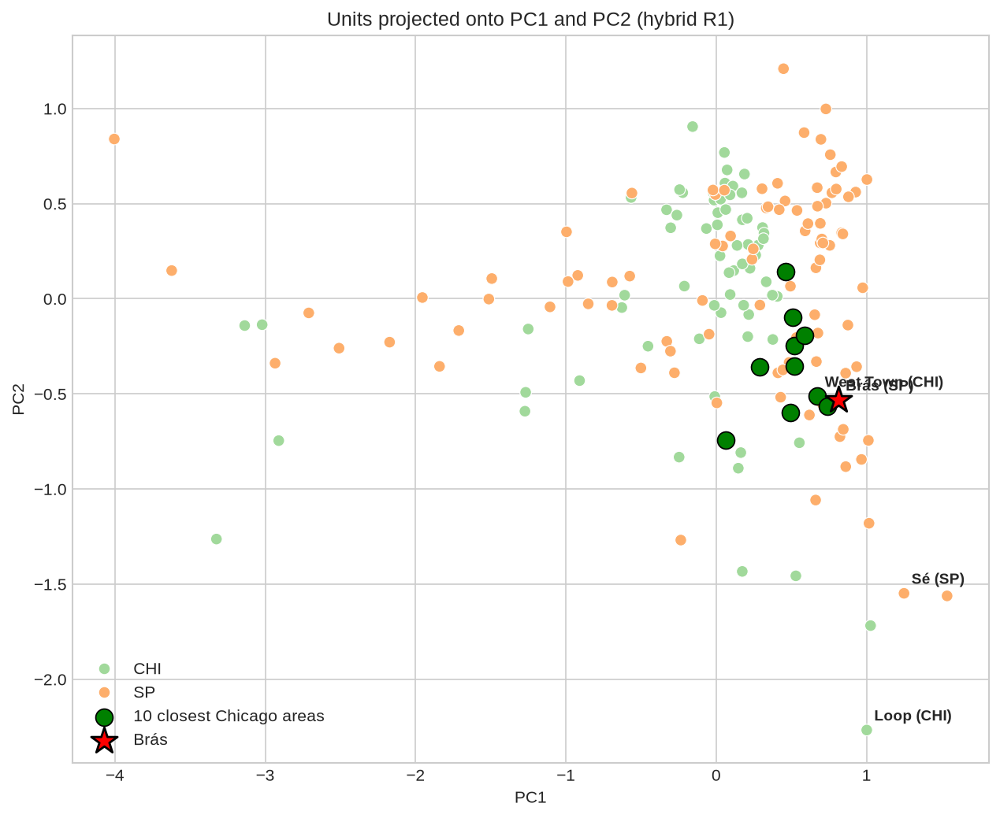
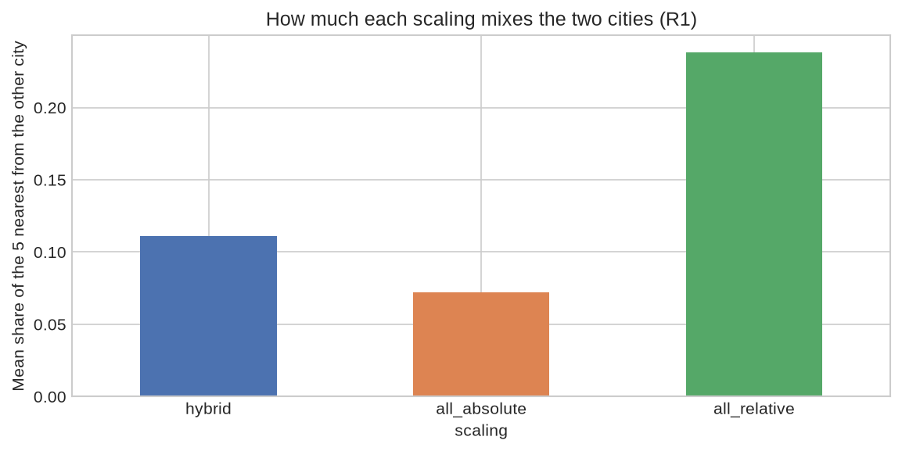
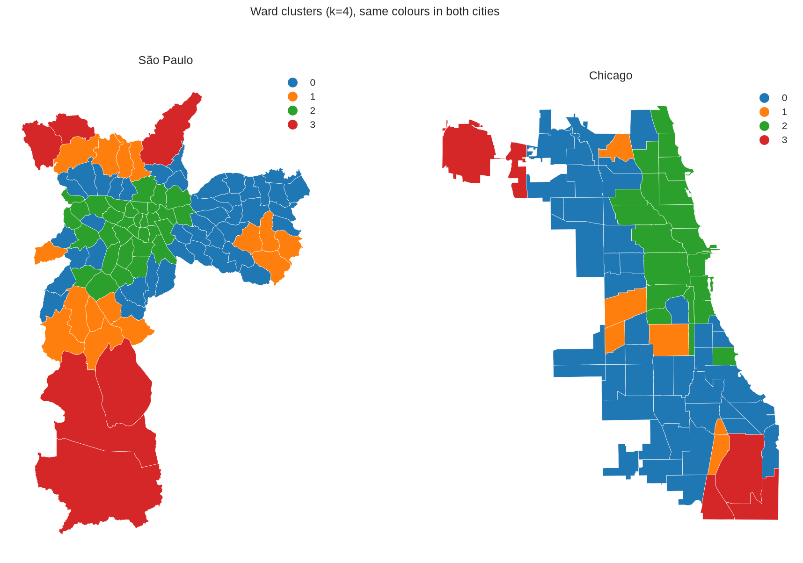

# São Paulo–Chicago urban similarity model (`sp_chicago_model_v1`): methodology and results

**Status:**
- **Current version: `sp_chicago_model_v2`, fitted 8 October 2026.** It is v1 with the U1 commerce land share added by user decision; see [§11](#11-version-2-u1-commerce-share-8-october-2026). Any further change is `sp_chicago_model_v3`.
- **§1–10 describe `sp_chicago_model_v1`**, fitted 6 October 2026 under the user's C6 decision (hybrid primary; all-absolute and all-relative as extra steps). v1 is kept unchanged and stays reproducible (`SP_CHI_MODEL_VERSION=v1`).

| Item | Location |
|---|---|
| Contract | v2: [`analysis/config/sp_chicago_model_v2.json`](../../analysis/config/sp_chicago_model_v2.json); v1: [`sp_chicago_model_v1.json`](../../analysis/config/sp_chicago_model_v1.json). Both use the 12 family definitions of [`chicago_model_v1.json`](../../analysis/config/chicago_model_v1.json); v2 overrides U1's columns |
| Code | [`analysis/scripts/sp_chicago_model.py`](../../analysis/scripts/sp_chicago_model.py) (reuses [`chicago_model.py`](../../analysis/scripts/chicago_model.py)) |
| Notebook (builds the model, all plots and tables) | [`analysis/sp_chicago_model_analysis.ipynb`](../../analysis/sp_chicago_model_analysis.ipynb) |
| Outputs | v2: [`analysis/results/SP_CHI/sp_chicago_model_v2_2026_10_08/`](../../analysis/results/SP_CHI/sp_chicago_model_v2_2026_10_08/README.md); v1: [`…/sp_chicago_model_v1_2026_10_06/`](../../analysis/results/SP_CHI/sp_chicago_model_v1_2026_10_06/README.md) |
| Interactive explorer | [`viz/`](../../viz/README.md): any reference unit, family and within-family weights |
| Decision record | [MODEL_PLAN.md](../chicago/MODEL_PLAN.md), cross-city section |
| Feature-by-feature evidence | [Chicago model report §3](../chicago/MODEL_REPORT.md#3-the-features) and each family's results README |

## 1. Question

**Which Chicago Community Areas most resemble Brás?**
- Brás is São Paulo district SP:10: a dense, older central district of retail and garment workshops.
- The model places all 173 units (96 São Paulo districts, 77 Chicago Community Areas) in one space, built from 20 measurements in 12 feature families.
- It measures the dissimilarity between every pair, then ranks the units by how close they are to Brás. Rankings are shown for all units and for the 77 Chicago areas.

## 2. The features

The same 12 families as the Chicago model, built with the same definitions in both cities. Each was accepted step by step with checks fixed before the results were seen.

| Family | What it measures | Chicago source | São Paulo source | Same instrument? |
|---|---|---|---|---|
| M1 street density | street km per km² of land | Overture streets | Overture streets | yes |
| M3 block size | size of the block a typical m² of land sits in | Overture street faces | Overture street faces | yes |
| M4 block shape | compactness, elongation | Overture street faces | Overture street faces | yes |
| M6 street hierarchy | major-road share of street length | Overture streets | Overture streets | yes |
| M7 ground-parcel density | parcels per km² of land | Cook 2024 ground parcels | GeoSampa fiscal lots | yes (ground parcels; a condominium counts once in both) |
| B1 footprint coverage | building footprint share of land | Overture buildings | Overture buildings | yes |
| U3 resident density | residents per km² of land | ACS 2020–2024 | Census 2022 | yes (residents) |
| BV vertical form | built-surface-weighted height | GHSL | GHSL | **no**: reads about 10–15% higher in São Paulo against LiDAR |
| U2 job density | registered jobs per km² of land | LODES 2023 | RAIS 2022 | **no**: different registers |
| U4 transit access | PTAL index averaged over residents | CTA bus, 'L', Metra | SPTrans bus, Metrô, CPTM | **no**: the index rises with route count |
| U6 activity composition | establishments per 100 dwellings, and their mix of five classes | Overture places + ACS dwellings | Overture places + CNEFE dwellings | **no**: place coverage differs by country |
| U1 land-use shares | residential, industrial, institutional shares of occupied land | CMAP 2023 (observed) | IPTU 2026 (declared) | **no** |

Missing: U1 for O'Hare, Marsilac and Parelheiros (under 10% classified land). Those pairs use the families both units have.

## 3. How the two cities are put on one scale (C6)

**The issue, with real numbers.**

| | Residents per km² | Position in its own city |
|---|---|---|
| Brás | 10,690 | 52nd of 96 (São Paulo median 11,110) |
| Loop | 10,739 | near the top (Chicago median 4,488) |

- **Absolute comparison** reads them as identical on density.
- **Relative comparison** reads Brás as an ordinary São Paulo district and the Loop as one of Chicago's densest.

Absolute comparison is right when the number means the same thing in both cities. Relative comparison is the safe choice when the measuring instrument differs. For example, the transit index's typical value is 14.2 in São Paulo and 5.7 in Chicago, partly because the index grows with route counts.

**What each scaling does.** Every transformed column is standardized, $z = (t - \bar t)/s$, and capped at ±3:
- **Absolute:** mean and SD from all 173 units.
- **Relative:** from the unit's own city.
- **Hybrid (primary):** absolute for the same-instrument families (M1, M3, M4, M6, M7, B1, U3); relative for the rest (BV, U2, U4, U6, U1).
- **All-absolute** and **all-relative** apply one rule to every column.



**What relative scaling cannot do.** It removes a city-wide shift and stretch caused by an instrument. It does not fix an instrument that mis-ranks units *inside* a city; those limits stay with each family.

## 4. How the distance is calculated

Identical to the Chicago model ([its report §4](../chicago/MODEL_REPORT.md#4-how-the-model-is-calculated) has the full derivation), but over 173 units:
- **Transforms.** Log for densities, transit, height and elongation; identity for shares, indices and log-ratios.
- **U6 composition.** Aitchison distance on the five centred log-ratios (city-centred except in all-absolute).
- **Calibration.** Each family is a block (U6 is two, half its budget each), divided by its median pairwise value over all 14,878 pairs.
- **Weights.** Equal family budgets (1/12).
- **Distance.** $D=\sqrt{\sum_b w_b\,m_b/\beta_b}$, renormalized over the families both units have.

**Three runs:**
- **R1** equal weights.
- **R2** PCA weights: distance on the principal components that explain ≥ 90% of the variance, as in `model_analysis`.
- **R3** without correlated features: scalar columns dropped while any pair has |ρ| ≥ 0.70.

All rules were fixed before any cross-city value was computed.

## 5. Results (hybrid scaling)

### 5.1 R1: equal weights

**Brás's ten closest Chicago areas:**

| Chicago rank | Area | Distance | Rank among all 172 |
|---|---|---|---|
| 1 | West Town | 1.075 | 11 |
| 2 | Avondale | 1.119 | 14 |
| 3 | Logan Square | 1.143 | 16 |
| 4 | Lincoln Park | 1.196 | 25 |
| 5 | Lower West Side | 1.227 | 28 |
| 6 | North Center | 1.240 | 29 |
| 7 | McKinley Park | 1.276 | 32 |
| 8 | Edgewater | 1.277 | 33 |
| 9 | Lake View | 1.277 | 34 |
| 10 | Albany Park | 1.286 | 35 |

**Brás's ten closest units overall** are all in São Paulo: Belém 0.716, Bom Retiro, Lapa, Cambuci, Mooca, Tatuapé, Ipiranga, Santa Cecília, Vila Guilherme, Pinheiros. These are the old inner-ring industrial and commercial districts around Brás, which supports face validity. The closest Chicago area enters at rank 11.

**Reading.**
- Brás's Chicago analogues are the **near northwest side** (West Town, Logan Square, Avondale and neighbours) plus **Lower West Side (Pilsen) and McKinley Park**. These are older, dense, mixed-use areas on a fine grid with commercial corridors and an industrial past.
- The **Loop** ranks only 69th of the 77 Chicago areas: it is a high-rise office centre, not a dense mixed district of shops and workshops.



**Worked example, Brás vs West Town.** $D^2 = 1.155$, so $D = 1.075$.

| Family | Share of $D^2$ |
|---|---|
| B1 coverage | 40% (Brás covers 57% of its land with buildings, far above West Town) |
| U6 activity composition | 23% (Brás is retail- and workshop-heavy) |
| U1 land shares | 15% (Brás has very little residential land) |
| U4 | 6% |
| Each of the other families | under 5% |

On street layout, block size and shape, parcels and residents the two are very close.





**Caveat on weights, as in the Chicago model.** Equal budgets equalize *typical* pairs. Block size (M3) has a narrow centre with long tails, so it carries **18.9%** of all squared differences on average against the nominal 8.3%, and over half of $D^2$ in 2,302 of 14,878 pairs. For Brás this matters little:
- Removing M3 keeps all five of Brás's closest Chicago areas.
- A post-hoc mean calibration also keeps all five.

### 5.2 Principal components and R2 (PCA weights)

Five components carry 90.3% of the variance.

| Component | Share | Reading |
|---|---|---|
| **PC1** | 55.1% | **Grain axis.** M3 block size −0.95, M1 0.91, M7 0.80, B1 0.77, U3 0.70. Fine, dense, built-up fabric against coarse land |
| **PC2** | 19.2% | **Residential vs central-arterial axis.** U1 residential land 0.75 against M6 major-road share −0.81, BV height −0.77, U2 jobs −0.70 |

Brás and West Town sit side by side; the Loop and Sé are far out on the central end of PC2.



**R2: Brás's closest Chicago areas.** West Town 0.786, Avondale, Logan Square, Lincoln Park, North Center, Lower West Side, Lake View, McKinley Park, Edgewater, Albany Park. These are the same ten as R1, in nearly the same order.

### 5.3 R3: without correlated features

| Dropped | Correlated partners kept |
|---|---|
| B1 coverage | U3 0.79, M1 0.78, M7 0.75 |
| U2 jobs | U6 intensity 0.83 |
| M1 streets | M7 0.76 |

Nine families remain. **Brás's closest Chicago areas:** West Town, Avondale, Lower West Side, McKinley Park, Logan Square, Lincoln Park, West Garfield Park, North Center, Bridgeport, Humboldt Park. West Town stays first; the southwest-side industrial-mixed areas move up.

## 6. Scale comparison: all-absolute and all-relative (the two extra steps)

**Brás's five closest Chicago areas in each scaling and run:**

| Scaling, run | 1 | 2 | 3 | 4 | 5 |
|---|---|---|---|---|---|
| hybrid R1 | West Town | Avondale | Logan Square | Lincoln Park | Lower West Side |
| hybrid R2 | West Town | Avondale | Logan Square | Lincoln Park | North Center |
| hybrid R3 | West Town | Avondale | Lower West Side | McKinley Park | Logan Square |
| all-absolute R1 | West Town | Lincoln Park | Near North Side | Logan Square | Avondale |
| all-absolute R2 | West Town | Near North Side | Lincoln Park | Lake View | Logan Square |
| all-absolute R3 | West Town | Avondale | Lower West Side | Logan Square | McKinley Park |
| all-relative R1 | Lower West Side | McKinley Park | West Town | Avondale | Logan Square |
| all-relative R2 | Lower West Side | West Town | McKinley Park | Avondale | Lincoln Park |
| all-relative R3 | Lower West Side | McKinley Park | West Town | Avondale | Logan Square |

**Agreement with the hybrid R1:**

| Scaling, run | All pairs (Spearman) | Shared top-5, all units | Brás's distances to the 77 Chicago areas (Spearman) | Brás's Chicago top-10 kept | Mean share of nearest five from the other city |
|---|---|---|---|---|---|
| hybrid R1 | 1 | 1 | 1 | 10 | 0.111 |
| hybrid R2 | 0.992 | 0.717 | 0.988 | 10 | 0.142 |
| hybrid R3 | 0.984 | 0.815 | 0.971 | 7 | 0.136 |
| all-absolute R1 | 0.960 | 0.822 | 0.951 | 8 | 0.072 |
| all-absolute R2 | 0.950 | 0.665 | 0.939 | 8 | 0.089 |
| all-absolute R3 | 0.968 | 0.719 | 0.966 | 7 | 0.083 |
| all-relative R1 | 0.954 | 0.743 | 0.981 | 7 | 0.238 |
| all-relative R2 | 0.947 | 0.578 | 0.976 | 8 | 0.276 |
| all-relative R3 | 0.902 | 0.640 | 0.966 | 7 | 0.261 |

**Reading.**
- **The answer for Brás is robust to the scaling choice.**
  - West Town is in the top three of all nine runs.
  - Avondale and Logan Square are in the top five of eight of nine.
  - Brás's distances to the Chicago areas agree with the hybrid at 0.94–0.99.
- **The scaling choice decides two things:**
  1. **Which Chicago face of Brás comes first.**
     - Absolute levels favour the denser, more built-up north side and bring in **Near North Side**, because Brás's absolute densities and transit are high.
     - Relative levels favour **Lower West Side and McKinley Park**: areas that, like Brás inside São Paulo, are unusually commercial and industrial for their city.
  2. **How much the cities mix.** Under absolute levels 7% of each unit's nearest five come from the other city; under relative levels 24%. Absolute scaling keeps instrument and level differences that separate the cities; relative scaling removes them.
- **Brás's own nearest five are all São Paulo districts in every run** except all-relative R1 and R3, where one Chicago area enters.



## 7. Stability and sensitivities (hybrid R1)

**Weight draws.** 500 draws, each family's budget × uniform factor in [0.5, 1.5].
- **75.8%** of the 865 top-five relations are stable (≥ 80% of draws).
- 40 of 173 units have all five neighbours stable.

Brás's closest Chicago areas under the draws:

| Area | Share of draws in Brás's Chicago top 5 | Stable |
|---|---|---|
| West Town | 100% | yes |
| Avondale | 100% | yes |
| Logan Square | 100% | yes |
| Lincoln Park | 92% | yes |
| Lower West Side | 55.8% | **no**: the fifth place is not firm |

**Sensitivities (against hybrid R1).**

| Scenario | All pairs | Shared top-5 | Brás's Chicago top-5 kept |
|---|---|---|---|
| Leave one family out (range over 12) | 0.906–0.997 | 0.816–0.916 | 3–5 (3 without U4) |
| Equal budget per domain | 0.986 | 0.865 | 4 |
| Robust median/IQR scaling | 0.982 | 0.888 | 4 |
| Rank-normal scaling | 0.861 | 0.719 | 5 |
| Ledoit-Wolf Mahalanobis (without U1) | **0.737** | **0.447** | **1** |
| M3 unweighted | 0.903 | 0.838 | 5 |
| M7 median parcel size | 0.993 | 0.879 | 5 |
| BV volume | 0.990 | 0.865 | 5 |
| U6 confidence ≥ 0.3 | 1.000 | 0.992 | 5 |
| *Post hoc:* mean calibration | 0.961 | 0.839 | 5 |

**Reading.**
- Results hold under every reweighting and alternative definition **except Mahalanobis**. Mahalanobis removes the shared correlation among features, which is mostly the grain axis, and so yields a different notion of similarity.
- Dropping U4 (transit) changes Brás's Chicago top five the most among single families.

## 8. Descriptive clusters (Ward, k = 4, silhouette 0.262)

The clusters **cross the two cities**, a sign that the hybrid scaling compares urban types rather than countries.

| Cluster | São Paulo | Chicago | Character |
|---|---|---|---|
| 0 | 42 | 47 | Residential fabric of both cities (Chicago northwest and southwest sides; São Paulo's east, north and south residential districts such as Penha, Itaquera, São Mateus, Pirituba) |
| 1 | 15 | 6 | Mixed industrial edges and peripheral informal fabric (Archer Heights, Pullman; Brasilândia, Cidade Tiradentes) |
| 2 | 33 | 20 | **Brás's cluster**: dense mixed central and inner-ring areas (Brás, Belém, Bom Retiro, Sé, República; West Town, Logan Square, Lincoln Park, Lake View, the Loop) |
| 3 | 6 | 4 | Large-land: airport, heavy industry, rural south (O'Hare, Hegewisch; Marsilac, Parelheiros) |



## 9. Limits

**Method.**
- **No external truth.** The model describes; there is no outcome against which similarity itself is validated. Evidence comes from each family's checks, the São Paulo face validity (Brás's nearest are its inner-ring neighbours) and the robustness tables.
- **The scaling choice is a modelling decision, not a finding.** The hybrid is the primary; the two alternatives show what depends on it (§6).
- **Block size (M3) weighs more than its budget** (18.9% on average). Brás's results are unaffected, but city-wide rankings are not neutral to it.
- **The ±3 cap compresses extremes** (the Loop on jobs, height and transit; Marsilac on several columns).

**Instruments.**
- **Relative scaling keeps within-city instrument errors:** RAIS head-office registration, LODES location error, Overture's formal-economy bias, GHSL's compression of tall buildings.
- **Vintages differ:** Overture 2026, Census 2022 and ACS 2020–2024, RAIS 2022 and LODES 2023, IPTU 2026 and CMAP 2023, GHSL 2018.

**Specific units.**
- **Brás's fifth Chicago match is not stable**; the first four are.

## 10. Reproducing

```
cd analysis
jupyter nbconvert --to notebook --execute --inplace sp_chicago_model_analysis.ipynb
```

- Run it with the repository `.venv` kernel. It rebuilds every table and figure.
- Inputs are refused if any table's SHA-256 differs from the one recorded at acceptance.
- Seed 20261006.
- `python analysis/scripts/sp_chicago_model.py` runs the module check.

## 11. Version 2: U1 commerce share (8 October 2026)

### 11.1 What changed and why

- **Change.** U1 compares **four** land-use shares instead of three: residential, **commerce**, industrial and institutional (21 columns instead of 20). Nothing else changed: same tables and SHA-256, transforms, C6 scaling (U1 relative), calibration, equal family budgets and runs. Contract [`sp_chicago_model_v2.json`](../../analysis/config/sp_chicago_model_v2.json).
- **Why (user decision, 8 October 2026).** Commercial land is central to Brás's profile. Brás devotes **65.0%** of its classified occupied land to commerce, 3rd of 94 São Paulo districts with U1 (city median 22.9%; Chicago median 10.5%), z = +2.68 within São Paulo.
- **What the decision overrides.** The commerce share failed the pre-registered J-3 admission rule: its largest |Spearman| with U6, B1 and M1 is 0.708 with U6 intensity in São Paulo (rule < 0.70 in both cities; Chicago 0.445 with U6 intensity, 0.593 with the food-and-drink log-ratio). Commercial land and establishments per dwelling are two instruments for overlapping things, so v2 counts part of the commercial signal twice, once in U6 and once in U1. The overlap is accepted and reported here, not corrected.
- **Within the family.** The four shares are averaged with equal weights, so each carries a quarter of U1's 1/12 budget. The explorer and Curio lane H let users change these weights. The block's calibration is then recomputed on the reweighted block, so a column weight changes only the mix inside U1, and U1's own weight still sets how much the family counts:

$$m_{U1}(d,e)=\frac{\sum_j v_j\,(x_{dj}-x_{ej})^2}{\sum_j v_j},\qquad v_j = 1 \text{ in the published fit.}$$

  Setting the commerce weight to 0 reproduces v1 exactly (checked in `analysis/tests/check_viz_model.js` and Curio `run_local.py`, maximum difference 2.2e-10 and 2.2e-15).

### 11.2 How much the model moves

| Comparison, hybrid R1 | v2 against v1 |
|---|---|
| Spearman over all 14,878 pair distances | 0.9996 |
| Mean shared top-5 neighbours over all units | 0.975 |
| Brás's distances to the 77 Chicago areas (Spearman) | 0.9985 |
| Brás's Chicago top 10 kept | 10 of 10 |

### 11.3 Brás under v2 (hybrid R1)

| Chicago rank | v2 area | Distance | Rank among all 172 | v1 area (distance) |
|---|---|---|---|---|
| 1 | West Town | 1.096 | 12 | West Town (1.075) |
| 2 | Avondale | 1.132 | 14 | Avondale (1.119) |
| 3 | Logan Square | 1.148 | 15 | Logan Square (1.143) |
| 4 | Lincoln Park | 1.182 | 18 | Lincoln Park (1.196) |
| 5 | **North Center** | 1.271 | 29 | Lower West Side (1.227) |
| 6 | Lake View | 1.278 | 30 | North Center |
| 7 | Lower West Side | 1.278 | 31 | McKinley Park |
| 8 | Edgewater | 1.290 | 33 | Edgewater |
| 9 | Albany Park | 1.298 | 34 | Lake View |
| 10 | McKinley Park | 1.318 | 35 | Albany Park |

**Reading.**
- The first four are unchanged, and Lincoln Park moves closer: it is the most commercial of them (27.7% commerce land).
- Lower West Side drops from 5th to 7th. Its land is industrial (49.2%) rather than commercial (13.1%), so the new share separates it from Brás. North Center enters the five.
- Brás's ten closest units remain São Paulo inner-ring districts. **Bom Retiro (0.752) now precedes Belém (0.755)**; the closest Chicago area enters at rank 12 (v1: 11). The Loop ranks 67th of 77 Chicago areas (v1: 69th): its commerce share is the highest in Chicago (58.6%), but height, jobs and transit still set it apart.
- **Worked example, Brás vs West Town:** $D^2 = 1.201$, so $D = 1.096$. B1 coverage 38.1%, U6 activity 22.0%, **U1 land shares 18.2%** (v1: 15.0%), U4 6.1%, every other family under 5%.

**Stability under 500 weight draws** (seed 20261006): West Town, Avondale and Logan Square 100%, Lincoln Park 99.8%. These four are firmer than in v1. **North Center 27.0%: the fifth place is not firm**, as in v1, where Lower West Side held it in 55.8% of draws. Over all units, 77.5% of top-five relations are stable (v1: 75.8%).

### 11.4 Across scalings and runs

West Town is in Brás's Chicago top three in all nine scaling × run combinations, as in v1. Relative scaling still puts Lower West Side first.

| Scaling, run | 1 | 2 | 3 | 4 | 5 |
|---|---|---|---|---|---|
| hybrid R1 | West Town | Avondale | Logan Square | Lincoln Park | North Center |
| hybrid R2 | West Town | Logan Square | Avondale | Lincoln Park | North Center |
| hybrid R3 | West Town | Avondale | Lincoln Park | Logan Square | Lower West Side |
| all-absolute R1 | West Town | Lincoln Park | Near North Side | Lake View | Logan Square |
| all-relative R1 | Lower West Side | Avondale | West Town | McKinley Park | Lincoln Park |

**R3 pruning** (|ρ| ≥ 0.70 on the scaled 173 values) drops the same columns as v1 under hybrid (B1, U2, M1) and all-relative (U2, M3) scaling; commerce now appears among U2's correlated partners (0.70). Under **all-absolute** scaling R3 also drops the **commerce share itself** (correlated 0.76 with BV height on absolute levels), with B1, U2, U4 and M1.

### 11.5 Structure

- **Family contributions over all pairs:** U1 carries 6.4% of $D^2$ on average (v1: 6.9%) against a nominal 8.3%, and over half of $D^2$ in 4 pairs (v1: 13). The calibration keeps U1's typical contribution at its budget; the extra column changes which pairs U1 separates, not how much U1 counts. M3 still carries the most (19.0%).
- **PCA:** five components carry 90.5%. PC1 (55.3%) is the same grain axis. **PC2 (19.5%) now also loads the commerce share (−0.75)** next to M6 major roads (−0.81) and BV height (−0.77), against residential land (+0.74): a residential versus central-commercial axis.
- **Ward clusters:** still k = 4 (silhouette 0.258; v1 0.262). Brás's cluster gains Alto de Pinheiros and Morumbi (35 São Paulo + 20 Chicago units).
- **Sensitivities:** leave-one-family-out agreement 0.906–0.997; Ledoit-Wolf Mahalanobis keeps none of Brás's Chicago top five (v1: one). Full table: `tables/sensitivities_hybrid.csv`.

### 11.6 Limits added by v2

- **Double counting.** In São Paulo, commerce land rises with establishments per dwelling (0.708). A unit with both high is now further from residential units than v1 made it.
- **Instruments differ by city, as for the other U1 shares:** observed CMAP land use (2023) in Chicago, declared IPTU use (2026) in São Paulo; U1 is therefore compared relative to each city. Primary use per lot hides vertical mixing in both.
- **Same missing units:** O'Hare, Marsilac and Parelheiros have no U1 (all four shares).

Reproduce: `jupyter nbconvert --to notebook --execute --inplace analysis/sp_chicago_model_analysis.ipynb` (v2 is the default; `SP_CHI_MODEL_VERSION=v1` rebuilds v1 into its own folder).
